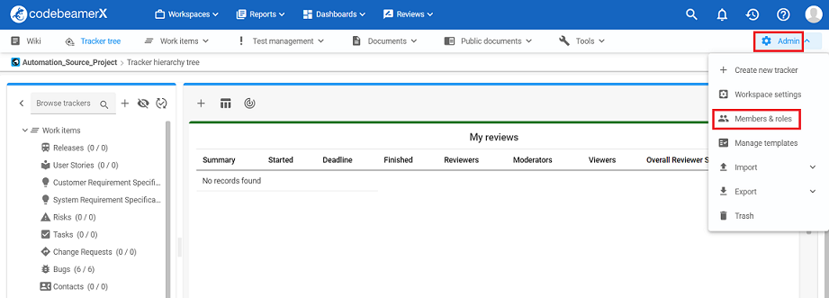
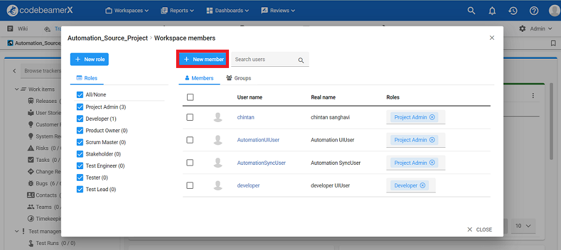
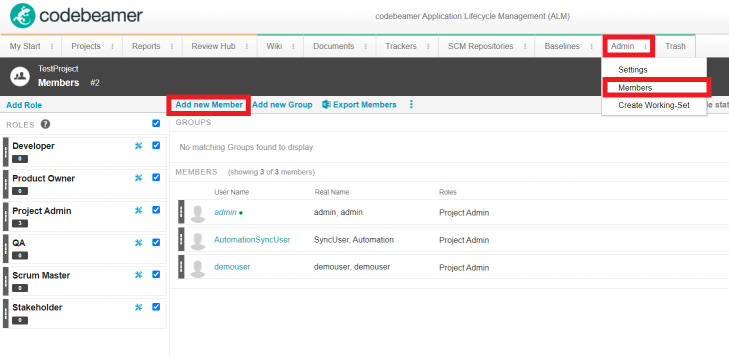
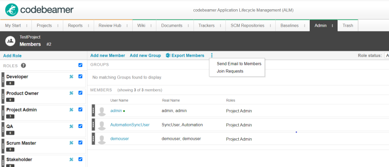
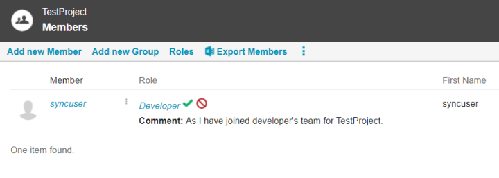
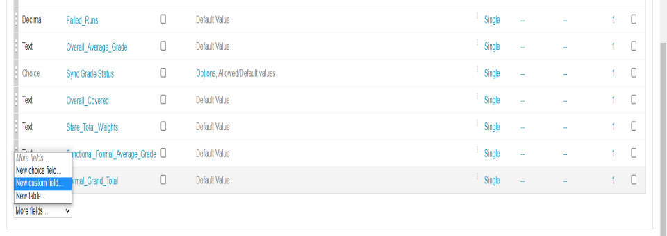
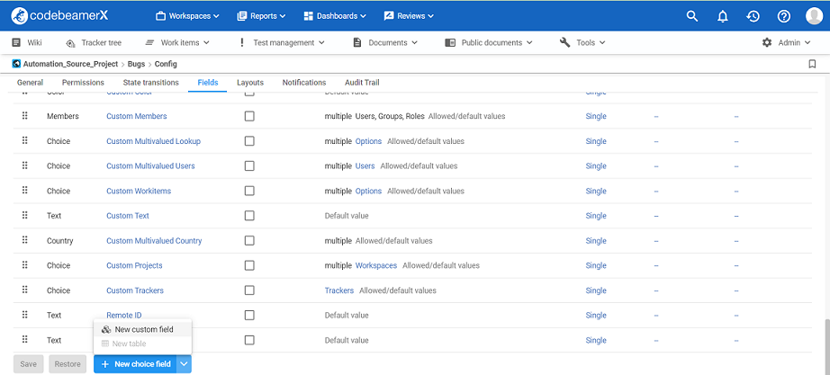
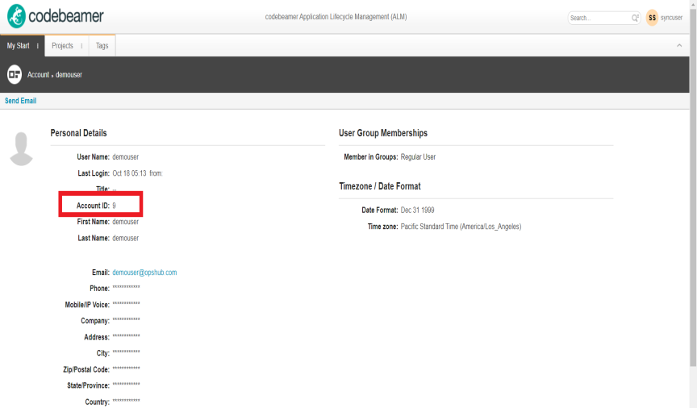

# Pre-requisites

## User privileges

* Create one user in codebeamer/codebeamer X that is dedicated to {{ spaceName }}. This user should not do any operations from the system's interface. This user should not do any operations from the system's interface. This user's timezone should be same as end system's server timezone. Refer to [Add User](#add-user) section to create a user in codebeamer/codebeamerX.
* The user must be a member of all the projects that needs to be synchronized. To add a Project member refer to section [Add Project Member](#add-project-member).
* The User group of user should have the following permissions. Refer to section [Add User Group](#add-user-group) to create user group.
  * Own Account - Admin
  * Account - View Email Address
  * Group - View
  * Time Zone and Date Format - Edit if Owner
  * Rest / Remote API - Access
* The user should have below mentioned permissions over tracker. Please refer to [Add User Permission Over Tracker](#add-user-permission-over-tracker) section to add user permissions over tracker.
  * Item - View Any  
  * Item - Add  
  * Item - Edit Any  
  * Tracker - Mass Edit  
  * Item - Close  
  * Item - Delete  
  * Item - History View  
  * Item - View Comments/Attachments  
  * Item - Add Comment/Attachment  
  * Item - Edit Comment/Attachment - Own  
  * Item - Edit Comment/Attachment - Any  
  * Item - View Associations  
  * Item - Edit Associations
* To synchronize Test case from any connector to codebeamer/codebeamer X, Integration User should be project admin and project admin role should have both read and edit permissions.

# System Configuration

Before you continue with the integration, you must first configure codebeamer/codebeamerX system in {{ spaceName }}.

Click [System Configuration](../integrate/system-configuration.md) to learn the step-by-step process to configure a system.

Refer to the following screenshot for reference:

<p align="center">
  
</p>

## codebeamer/codebeamerX System Form Details

| **Field Name**                     | **When field is visible on the System form** | **Description** |
|-----------------------------------|---------------------------------------------|-----------------|
| **System Name**                   | Always                                      | Provide codebeamer/codebeamerX System Name |
| **Version**                       | Always                                      | Provide the version for the codebeamer/codebeamerX system. Refer to section [Find version of codebeamer/codebeamerX Instance](#find-version-of-codebeamer/codebeamerx-instance), to determine the version of codebeamer/codebeamerX system. |
| **Instance URL**                  | Always                                      | Provide Server URL of the codebeamer/codebeamerX instance. This URL will be used for communicating with codebeamer/codebeamerX system API. The format of the URL would be: `http://[host name]:[port no]/cb` or `http://[your_domain_name]/cb`. Example: `http://10.13.27.200:8080/cb` or `http://10.13.27.208:8080/cb`. |
| **Base URL for Remote Link**      | Always                                      | Provide different Instance URL of the codebeamer/codebeamerX instance. This URL is used for generating the Remote Link. For example, if the Instance URL is `http://10.11.152.136:8080/cb` or any API node URL, but Remote Link needs to be generated with a different Instance URL such as `http://domain.com:8080/cb`. <br>**Note**:If "Base URL for Remote Link" is empty, It will use Instance/Server URL to generate Remote Link if configured on Integration. |
| **User Name**                     | Always                                      | Provide the username of a dedicated user who will be used for communicating with codebeamer/codebeamerX API. This user should have the required privileges as mentioned in section, [User privileges](#user-privileges). |
| **User Password**                 | Always                                      | Enter password of the user added above. |
| **Instance Time Zone**            | Always                                      | Provide the codebeamer/codebeamerX instance's timezone. <br>**Note**:The instance's timezone and the service user's timezone should be same. To verify the user's timezone, navigate to `System Administration / Server Status Dashboard / JVM system properties / user.timezone`. |
| **Formatting support for Wiki fields** | Always | Select **True** if you want to enable synchronization of formatting for the 'Wiki' fields of codebeamer/codebeamerX instances.  * This step involves an additional action of placing a JAR file on the codebeamer/codebeamerXs' server.  * To obtain this JAR, there are two approaches outlined below:   * **Approach 1**: Use the JAR already built by OpsHub. Click [here] to Download.  * **Approach 2**: Build your own JAR. Refer to the steps for [How to generate conversion JAR](#how_to_generate_the_html_to_jspwiki_conversion_jar).  * Copy the JAR file to the `<CB_INSTALLATION>/tomcat/webapps/cb/WEB-INF/lib` folder, and then restart the codebeamer/codebeamerX server to apply the changes.  * Select **False** if you do not want to enable the synchronization of formatting for Wiki fields. In this case, the Wiki field's value will be displayed as plain text when synchronizing the Wiki fields to codebeamer/codebeamerX. For more details, please refer to [Known Limitations/Behavior](#known-limitationsbehavior). |

# Mapping Configuration

Map the fields between codebeamer/codebeamer X and the other system to be integrated to ensure that the data between both the systems synchronize correctly.

Click [Mapping Configuration](../integrate/mapping-configuration.md) to learn the step-by-step process to configure mapping between the systems.

## Test Step Field Configuration

For mapping additional fields for test steps like 'Critical' and other custom fields, advance XSLT will be modified. Add the following sample xslt in default xslt to map additional fields:

```xml
<xsl:element name="additionalFields">
    <xsl:element name="Id">
        <xsl:value-of select="additionalFields/Id"/>
    </xsl:element>
    <xsl:element name="Critical">
        <xsl:value-of select="additionalFields/Critical"/>
    </xsl:element>
    <xsl:element name="Additional_Field_Name">
        <xsl:value-of select="additionalFields/Additional_Field_Name"/>
    </xsl:element>
    <xsl:element name="MutiValued_Additional_Field_Name">
        <xsl:for-each select="additionalFields/MutiValued_Additional_Field_Name/string">
            <fieldvalue>
                <xsl:value-of select="text()"/>
            </fieldvalue>
        </xsl:for-each>
    </xsl:element>
</xsl:element>
```
> **Note**: For Test Step field all the columns must have some value. Null value or empty string will work only for text and lookup fields, not for integer, decimal, duration, boolean or date fields. `codebeamer/codebeamerX` will throw an error if fields or their values are absent. Based on this, the user can provide advance XSLT which provides default values as well.

## Synchronizing Test Step Results Field

* The "Test Step Results" field of the Test Run entity's behaviour as in `codebeamer/codebeamerX`:
  * When a test run is created, `codebeamer/codebeamerX` creates a child run for each associated test case, and the original run serves as the Parent(Main) Run. 
  * When `codebeamer/codebeamerX` is the target system in {{ spaceName }}: 
    * {{ spaceName }} will consider the test steps available at the time of Test Run creation to update the test step result. Consequently, the source system's test step data will be discarded. If the number of test steps to be updated differs from the test steps on the targeted Test Runs, the {{ spaceName }} will fail to update the Test Step Results.
      * Reason: Test Step Results are associated with the specific version of the test case. Hence, only Test Step Results can be updated, and the original test steps cannot be updated. 
    * If the "Test Step Results" need to be updated more than once, ensure that the {{ spaceName }} is configured in a way that the status is updated to a valid value to allow further updates to the Test Step Result. It can be achieved using the [Workflow Transition](Mapping_Configuration#Workflow_Transition).
      * Reason: Test Step Results can be updated only when the Parent (Main) Test Run and Child Test Run are not in a Finished, Suspended, or Closed state. Additionally, once the Test Step Results are updated, `codebeamer/codebeamerX` sets the status of the test run to "Finished", which means it cannot be updated until it is restarted/ its status is updated.

> **Note**: Since `codebeamer/codebeamerX` creates the child test run, configure the Status field settings with the "Set" distribution rule so the Child Test Run's status can also be updated based on the status of the Parent Test Run.

* The below functionalities are not supported for this field:
  * Test Step Results for a test run with multiple test case linkages.
  * Inline file/image synchronization
  * Reconciliation

## Synchronizing the Emojis

* When the codebeamer is the source system, advanced mapping is required for the synchronization of emojis of HTML fields.
* Given below is the sample advanced mapping for synchronizing the smile emoji from codebeamer to Visual Studio Team Services(ADO).

```xml
<Repro-space-Steps xmlns:xsl="http://www.w3.org/1999/XSL/Transform">    
    <xsl:variable name="Description" select="SourceXML/updatedFields/Property/Description"/>
    <xsl:value-of select="replace($Description,'&lt;img.*/cb/images/emoticons/smile.png.*ALT_WIKI:EMOTICON:%3A%29%20&quot;&gt;','&amp;amp;#128522;')"/>
</Repro-space-Steps>
```

> **Note**:In the advanced mapping, the emoji image will be replaced by the target format of specified emoji image. For multiple image occurances, they all must be replaced by target format of emojis.

## Comments and Attachments Configuration

Comments and Attachments do not exist independently. These are added through a section on a tracker named **Comments/Attachments**

* If both comments and attachments are mapped in Mapping Configuration, then inline image inside comments will be synchronized to target along with attachments.
* If only comments are mapped in Mapping Configuration, then only comments will be synchronized along with inline images inside comments. If there are comments which have attachments, but they are not inline, then they will not be synchronized.
* If only attachments are mapped in Mapping Configuration then no comments will be synchronized. Only attachments will synchronize to the target system.

## Relationship Configuration

In codebeamer/codebeamerX, Associations and Reference fields will be supported as relationships.

### Associations

* All associations will be synchronized as links to the target system.
* On {{ spaceName }} User Interface, for every association type, two link types will be shown.
* Associations added by marking Reverse Order check box on codebeamer/codebeamerX User Interface (refer to the following screenshot) will be marked as "<association_name> (reverse order)" on {{ spaceName }} User Interface.
* Associations added without marking Reverse Order check box on codebeamer/codebeamerX User Interface will be marked as "<association_name>" on {{ spaceName }} User Interface.

<p align="center"></p>
<p align="center"></p>

## Reference fields

* Reference fields are the fields that refer to some other codebeamer/codebeamerX entity.
* Reference fields will be synchronized through relationships. For references, the names of the Reference fields will be shown in link type mapping of the Relationship Configuration, as shown in screenshot below:

<p align="center"></p>

* Custom reference field's name would also be shown in the link types.
* For synchronizing reference fields value, map the reference field as links, as shown in screenshot below:

<p align="center"></p>

> **Note**: Reference fields in field mapping will be read-only fields.

## Mapping for Entity mention field

* When codebeamer/codebeamerX is configured as source system in the integration and its field/comment type is rich text (HTML), then the entity mention synchronization is supported.
* Click on [Mapping_Configuration#Mention_Setting](../integrate/mapping-configuration.md#mention-setting) to know more about entity mention mapping and synchronization behavior in general.

## Advance Workflow Transition

To understand the need for handling workflow transition in codebeamer/codebeamerX, let us take an example: A 'Bug' in codebeamer/codebeamerX, when created should have 'New' status. It's status can then be set to 'Verified' or 'In progress' or 'Closed'. But it's status cannot be directly marked as 'Closed' from 'Verified' state because of the state transition constraints configured through codebeamer/codebeamerX tracker state transition.

Here is the diagram for this example:

<p align="center"></p>

In such scenarios, simply mapping State field and their look-up values can cause failure(s). If a codebeamer/codebeamerX Bug is in 'Verified' state and through the integration the status of it is attempted to be updated to 'Closed', codebeamer/codebeamerX will throw an error that the possible transition for codebeamer/codebeamerX Bug is from 'Verified' to 'In progress' and then from 'In progress'' to 'Closed'.

### Solution for handling workflow transition

This issue can be resolved by following any of these approaches:

**1. Add/Edit Workflow transition XML in Mapping configuration of {{ spaceName }}**

Click [Workflow Transition](../integrate/mapping-configuration#workflow-transition) to learn when and how to configure workflow transition xml mapping.  
With this option, {{ spaceName }} makes the required intermediate status transition automatically as per the transition(s) configuration on the end system.

**2. Add State Transitions in codebeamer/codebeamerX**  
For step-by-step instructions for configuring any-to-any transition refer: [Configure a new State Transition](#configure-a-new-state-transition).


## Mapping for Soft Delete Configuration

* When Codebeamer is the target system in the integration, the Soft Delete operation is performed by default in the synchronization of the [Source Delete event](../integrate/source-delete-synchronization.md).
* After the Soft Delete operation is performed by {{ spaceName }} in Codebeamer, the entity will be deleted in the Codebeamer. It can be found in the "Trash" of the corresponding project, where it existed earlier.
* To only enable the Logical Delete operation in the target, "OH Soft Delete" field should be mapped with the default value, "No" in the [Delete Mode](../integrate/mapping-configuration#delete-mode) mapping.


## Rank

* Codebeamer allows to organize the tracker items in tree structure. To synchronize the tracker items maintaining the tree structure, below configurations need to be performed in {{ spaceName }}.
  * Configure the **Hierarchy Child** and **Hierarchy Parent** relationship as per the standard [relationship configuration](../integrate/mapping-configurationmd#relationships).
  * Enable the rank synchronization, as described in [Rank configuration](../integrate/mapping-configuration#configuration) section.
    * Here make sure, the overwrite option is enabled for the Codebeamer system for OH ENABLE RANK field.

**Known Limitations**:  
* When Codebeamer is configured as the source system in {{ spaceName }}:
  * When rank change is performed on tracker item within same parent item, any field needs to be updated after changing the rank of the tracker item.
    * Reason: When rank is changed for any tracker item within the same parent, neither its **Updated** time is changed nor revision gets generated in codebeamer.

# Integration Configuration

In this step, set a time to synchronize data between codebeamer/codebeamerX and the other system to be integrated. Also, define parameters and conditions, if any, for integration.

Refer to [Integration Configuration](../integrate/integration-configuration.md) to learn the step-by-step process to configure the integration between two systems.

<p align="center"></p>

## Criteria Configuration

If you want to specify conditions for synchronizing an entity between codebeamer/codebeamerX and the other system to be integrated, you can use the Criteria Configuration feature.

Go to Criteria Configuration section in [Integration Configuration](../integrate/integration-configuration.md) page to learn in detail about Criteria Configuration.

To configure criteria in codebeamer/codebeamerX, integration needs to be created with codebeamer/codebeamerX as the source system. Set the **Query** as per cbQL Format.

* If field is of lookup type, then criteria query will be like `projectId.trackerId.fieldName = 'field-value'` or `workspaceId.trackerId.fieldName = 'field-value'`.
* To find out Tracker ID, refer to section [How to find Tracker Id](#how-to-find-tracker-id).
* For custom fields: `trackerTypeId.customFieldPropertyName = 'field-value'`
* For custom Choice fields: `projectId.trackerTypeId.customFieldPropertyName = 'field-value'` or `workspaceId.trackerTypeId.customFieldPropertyName = 'field-value'`
  * To find out custom field property name, refer to section [Find Custom Field Property Name](#find-custom-field-property-name)
* To know more about cbQL query in codebeamer/codebeamerX, refer to: [cbQL in codebeamer/codebeamerX](https://codebeamer.com/cb/wiki/871101)

**Criteria samples**

| **Field Type** | **Criteria Description** | **Criteria snippet** |
|----------------|---------------------------|------------------------|
| **Lookup** | Synchronizes all the entities having priority as "High". Here, 1 is project/workspace id and 2 is tracker id. | `'1.2.priority' = 'High'` |
| **Date** | Synchronizes entities whose startDate is after 2021-01-01 | `startDate > '2021-01-01'` |
| **Text** | Entities containing 'item' in Summary field | `summary LIKE '%item%'` |
| **User** | Assigned to user with id 3 | `assignedTo = 3` |
| **User and Lookup** | Assigned to user id 3 and Priority as High | `assignedTo = 3 and '1.2.priority' = 'High'` |
| **Lookup or Text** | Priority = High or Summary contains 'item' | `'1.2.priority' = 'High' or summary LIKE '%item%'` |
| **Custom Field** | Belong to tracker type 1, field `customField[1]` is Verified | `'1.customField[1]' = 'Verified'` |
| **Custom Choice Field** | Belong to project/workspace id 1, tracker type 2, field `choiceList[1]` = 'Option A' | `'1.2.choiceList[1]' = 'Option A'` |

> **Note**: For the integration with multiple projects configuration, query specific to each configured project/workspace can be combined using `or`.

### Sample queries:

- **Target Lookup Query for the constraint on the `single field`:**

  `Summary = '@Summary@'`

  **Description**:  
  It represents the query, which will select entities whose Summary field value is same as the value of the Source system's Summary.

- **Target Lookup Query for the constraint on the `multiple fields`:**

  - If the user needs to query on multiple fields, the user can provide multiple field values separated by **AND** or **OR** operators.

  `Summary = '@Summary@' and startDate = '@Start Date@'`

  **Description**:  
  This query will select entities whose Summary field value is same as the value of the Source system's Summary and Start Date is same as value mentioned in Start Date of Source System.

- **Target Lookup Query for the constraint on the `custom field`:**

  - Syntax: `'trackerTypeId.customFieldPropertyName' = '@[Source-Field-Name]@'`
  - To find out custom field property name, refer to section [Find Custom Field Property Name](#find-custom-field-property-name)

  `'16869.customField[1]' = '@oh_internal_id@'`

  **Description**:  
  It represents the query, which will select entities belonging to tracker type 16869, whose field with Property Name as customField[1] has value same as the value of the Source system's entity id.

# Known Limitations/Behavior

1. Once the tracker is configured in the {{ spaceName }}, it must not be renamed or else the integration configured for that tracker item would be invalid.

2. Following tracker item types/entities will not be supported:  
   - **Working Sets** (earlier known as Branches): Synchronize is only applicable for Master Branch. All the revisions which are done on the tracker item in the master (merge operations or normal revisions) will be synchronized.
   - **Baselines**: Synchronize will not consider the Baselines and will be only considering the HEAD\Default Baseline.  
   - **SCM commits and repositories**: Any SCM related entities such as SCM commits or Pull requests will not be supported.  
   - **Wiki pages and documents**: Non ALM type of entities such as wiki pages and documents will not be supported.  
   - **Timekeeping tracker types (Worklogs)** will not be supported.  

3. Currently, Table type fields are not supported.

4. Adding an association does not change the modified time of the entity. Hence, entity's associations will not synchronize until the next update on the entity updates its modified time.

5. JSPWiki fields will be shown as HTML in {{ spaceName }}.

6. When codebeamer/codebeamer X is the source system in {{ spaceName }}, and the content or name of inline image/file in JSPWiki field contains special characters like:
   •, €, £, Â¥, ©, ®, ™, µ, α, β, π, Ω, Σ, °, Δ, ☺, ♥, ₹, ¿, ¡, …, À, à, Â, Ã, Ä, Å, Æ, Ç, È, É, Ê, Ë, Ì, ì, Î, ì, Ñ, Ò, Ó, Ô, Õ, Ö, Ù, Ú, Û, Ü, ß, à, á, â, ã, ä, å, æ, ç, è, é, ê, ë, ì, í, î, ï, ñ, ò, ó, ô, õ, ö, ù, ú, û, ü, ÿ, Ğ, ğ, İ, ı, Œ, œ, Ş, ş, Ÿ  
   then due to API limitations, such characters might get lost during the synchronization. Additionally, formatting of the content will also not be preserved.

7. Lookup values for **Repository Choice field** will not be loaded. If the field is mapped and contains a value, then its value will be synchronized as plain text.

8. Currently, only Wiki is supported as Description format.

9. History for Test Step will not be synchronized. Test Step will be synchronized in the current state only.

10. For test runs, mapping **Test case link** is mandatory.

11. A link to another entity can be added multiple times on the same entity using different link types. In codebeamer/codebeamer X’s case, only the latest link type is returned, and so only that will be synchronized.

12. Inline documents will not be synchronized to codebeamer/codebeamer X.

13. History for attachments and links is not supported. They will be synchronized in the current state only.

14. **Read-only Fields**: There's no API that can be used to find read-only fields, so some fields may be shown as writable even when they are read-only.

15. **Calculated Fields**: Calculated fields are read-only from User Interface, hence they will be read-only.

16. **Mandatory Fields**: In codebeamer/codebeamer X, there are two ways in which a field can be set as mandatory:
    - **Mandatory in Status**: Fields that are mandatory in any of the states (except none) will be shown as mandatory field throughout.
    - **Mandatory if**: Uses a computed formula to determine if the field is mandatory. These cannot be retrieved through API and hence will be shown as non-mandatory in mapping configuration.

17. **Tracker Item Choice and Project Choice Field**:  
    - No API to retrieve tracker-wise lookup values for Tracker Item Choice.
    - Will retrieve all trackers from all projects.  
    - For Project Choice Field, all projects will be retrieved.

18. Entity can get locked in codebeamer/codebeamer X. User must edit and click Cancel/Save to unlock manually.

19. Parent and Child are not supported in codebeamer/codebeamer X across tracker types.

20. For Test Cases, if status is **Accepted** or **Rejected**, fields like Test Step, Pre Action, and Post Action cannot be edited.  
    *(To edit these fields, change status to redesign and then edit.)*

21. Attachment with fileComment is supported as a write operation. It will be read as a comment with an attachment when Codebeamer is the source system.

22. If **False** is selected in codebeamer/codebeamer X system configuration for **"Formatting support for Wiki fields"**, then:
    - As **target system**: Wiki fields sync as plain text.
    - As **source system**: Formatting is preserved, but updates will convert content to plain text (both source and target will lose formatting).

23. **Wiki Link/URL should not be mapped** in the mapping as they will lead to processing failures in synchronization.

24. For syncing of emojis in HTML fields with codebeamer as source system:
    - **Advanced Mapping** is used.  
    - The emoji image is replaced with the target-specific emoji format.

    **Replace function syntax in advanced mapping:**

    ```xml
    <xsl:value-of select="replace(fieldName, image tag of the emoji to be replaced, Format of the emoji in the target system)"/>
    ```

25. Diagram synchronization is **not supported** in rich text field.

26. For **Test Sets** entity, it is recommended to configure **"Test Cases"** link with the setting:  
    **Fail if not found**  
    **Reason**: Due to API limitations, other-way link operation is not supported.

# Appendix

## Find version of codebeamer / codebeamer X Instance

To find the codebeamer / codebeamer X version, follow the steps given below:

* Login to codebeamer / codebeamer X.
* The version is mentioned:
  - **For codebeamer**: at the bottom of the page  
  - **For codebeamer X**: in the help section  
  as shown in the screenshots below:

**codebeamer:**

<p align="center">
  
</p>


**codebeamer X:**

<p align="center">
  
</p>


---

## Add User

### Add User Group

* Login to codebeamer / codebeamer X with the Admin User.
* Select **System Admin** tab.
* Select **User Groups**.

**codebeamer:**

<p align="center">
  
</p>


**codebeamer X:**

<p align="center">
  
</p>


* Click on **New Group** link as shown in the screenshots below:

**codebeamer:**

<p align="center">
  
</p>


**codebeamer X:**

<p align="center">
  
</p>


* Fill in the details for the new user group. This user group should have the required privileges as mentioned in section, [User privileges](#user-privileges).

**codebeamer:**

<p align="center">
  
</p>


**codebeamer X:**

<p align="center">
  
</p>


* Click on **Save** button.

---

### Add User Account

* Login to codebeamer / codebeamer X with the Admin User.
* Select **System Admin** tab.
* Select **User Accounts** link as shown in the screenshots below:

**codebeamer:**
<p align="center">
  
</p>


**codebeamer X:**

<p align="center">
  
</p>


* Click on **New Account** link as shown in the screenshots below:

**codebeamer:**

<p align="center">
  
</p>

**codebeamer X:**

<p align="center">
  
</p>


* Fill in the details for new user account and click on **Save** button as shown in the screenshots below:

**codebeamer:**

<p align="center">
  
</p>

<p align="center">
  
</p>

**codebeamer X:**

<p align="center">
  
</p>

<p align="center">
  
</p>

<p align="center">
  
</p>

<p align="center">
  
</p>

### Add Project Member

#### Project Admin can directly add Project Members

* Login to codebeamer / codebeamer X with user having the project administrator role for the project in which you want to add member.
 cg* Open a **project** (codebeamer) / **workspace** (codebeamer X) in which you want to add member.
* Click the **three dots** (codebeamer) / **dropdown** (codebeamer X) beside Admin tab.
* Click **Members** (codebeamer) / **Members & roles** (codebeamer X) option.

**codebeamer X:**



* Click "**Add New Member**" (codebeamer) / "**New Member**" (codebeamer X) link as shown in screenshot below:

**codebeamer:**


**codebeamer X:**



* For further steps, refer to the codebeamer / codebeamer X documentation for adding a project member:  
[Add new Member](https://codebeamer.com/cb/wiki/11113#section-Add+or+invite+members)

---

#### Members added by Project Admin via User's Join Request (Only for codebeamer)

* If project membership is **Public with join approval**, then any user can request to join, but project administrators must approve each join request.
* Login as user who wants to become a member and follow the steps mentioned in the section, [hbMake Join Request for a Project](#make-join-request-for-a-project) for further details.
* Login as Project Administrator and follow the steps below to approve the join request:
  * Open a project for which you want to approve join request for Users.
  * Click the three dots provided beside the Admin tab.
  * Click on the Members option.



* Click three blue dots and select "Join Requests" option as shown in the screenshot below:



* Click the green check mark to approve the request and red mark to decline as shown in the screenshot below:



* Provide Notification Comment and select Accept/Reject button accordingly as shown in the screenshot below:


---

#### Joining a public project without further approval (Only for codebeamer)

* If project Membership is **Public**, then any user can join any time, without further approval.
* Login as user who wants to become Member and follow the steps mentioned in section [Make Join Request for a Project](#make-join-request-for-a-project)

---

#### Make Join Request for a Project (Only for codebeamer)

* Click on "Projects" tab.
* Click on "Available to Join" tab.
* Click on the Project link for which you want to make a join request as shown in the screenshot below:

<p align="center">
  
</p>

* Enter joining comment and click on Submit button as shown in the screenshot below:

<p align="center">
  
</p>


---

## Add User Permission Over Tracker

* Open the **project** (codebeamer) / **workspace** (codebeamer X) where you want to add custom field.
* Select "**Trackers**" (codebeamer) / "**Tracker tree**" (codebeamer X) tab.
* Right click on the tracker name for which you want to add custom field.
* Select the Configure option.

**codebeamer:**


**codebeamer X:**


* Select "Permissions" tab as shown in the screenshot below:

**codebeamer:**


**codebeamer X:**


* Provide permissions mentioned in [User privileges](#user-privileges) section for the role assigned to the user.

## How to find Tracker Id

* Open the **project** (codebeamer) / **workspace** (codebeamer X) where your tracker is present whose ID you want to find.
* Select "**Trackers**" (codebeamer) / "**Tracker tree**" (codebeamer X) tab.
* Click on the tracker name for which you want to find the ID.
* From URL you will get the tracker Id.

**codebeamer:**


**codebeamer X:**


## Add Custom Field

For creating custom field in codebeamer / codebeamer X, follow the steps given below:

* Open the **project** (codebeamer) / **workspace** (codebeamer X) in which you want to add custom field.
* Select **Trackers** (codebeamer) / **Tracker tree** (codebeamer X) tab.
* Right click on the tracker name for which you want to add custom field.
* Select the Configure option.

**codebeamer:**


**codebeamer X:**


* Select **Fields** tab as shown in the screenshot below:

**codebeamer:**


**codebeamer X:**


* Scroll down to extreme bottom of the page and click on **More fields...** (codebeamer) / **New Choice Field** (codebeamer X) drop-down list.
* Select **New Choice Field** option to add a choice type field or **New Custom Field** option to add other types of custom fields.

**codebeamer:**



**codebeamer X:**



* Fill in the details for new field to be added.
* Click on **OK** and **Save** buttons to save the changes.

---

## Find Custom Field Property Name

* Open tracker item configuration.
* Select **Fields** tab.
* Select the option **Show property name** just above the list of fields to display property name of all the fields.

**codebeamer:**


**codebeamer X:**


* Highlighted text in the image below shows property name for custom field "Custom Text".

**codebeamer:**


**codebeamer X:**


---

## Determine User ID

* Login to codebeamer / codebeamer X with user having the project administrator role. The project administrator and user must be the members of the project for which user ID has to be found.
* Open a **project** (codebeamer) / **workspace** (codebeamer X) in which the user is already a member for whom he/she wants to find the user ID.
* Click the **three dots** (codebeamer) / **dropdown** (codebeamer X) provided beside Admin tab.
* Click on **Members** (codebeamer) / **Members & roles** (codebeamer X) option.
* Click on the Member link for which the user wants to find user id.

**codebeamer:**


**codebeamer X:**

  


* Account ID is the required user ID as shown in the screenshot below:

**codebeamer:**



**codebeamer X:**


---

## Configure a new State Transition

Following are the steps to configure any-to-any transition:

* Open the **project** (codebeamer) / **workspace** (codebeamer X) for which the transition(s) needs to be configured.
* Select **Trackers** (codebeamer) / **Tracker tree** (codebeamer X) tab.
* Right click on the tracker name for which you want to add state transition.
* Select the Configure option.

**codebeamer:**


**codebeamer X:**


* Select **State Transitions** tab as shown in the screenshot below:

**codebeamer:**

<p align="center">
  
</p>


**codebeamer X:**

<p align="center">
  
</p>


* Look at the existing State Transitions. The possible transitions are:
  - New to Verified  
  - New to In progress  
  - New to Closed  
  - Verified to In progress  
  - In progress to Closed

<p align="center">
  
</p>


* Here, no direct transition is possible from Verified to Closed. To add this state transition, click on **More fields...** (codebeamer) / **More...** (codebeamer X) drop-down list.
* Select **State Transition** option.

**codebeamer:**

<p align="center">
  
</p>


**codebeamer X:**

<p align="center">
  
</p>


* Provide the details.

**codebeamer:**

<p align="center">
  
</p>


**codebeamer X:**

<p align="center">
  
</p>


* Click on **OK** and **Save** buttons to save the changes.

---

## How to Generate the HTML to JSPWiki Conversion JAR

1. Download the zip file from [here] and extract it.
2. Open the extracted folder and locate the `gradle.properties` file. In this file, for the `cbHome` parameter, specify the path to your **codebeamer / codebeamer X** installation directory.
3. Open the command prompt (it is recommended to run as Administrator) inside the extracted folder and execute the command:

   ```
   gradlew build
   ```

   to generate the build files.

> **Note**: After running the command mentioned above, a `build` folder will be generated inside the extracted folder.

4. Now, navigate to the `build` folder, and you will find a file named:

   ```
   OpsHubcodeBeamerHTMLToJSPWiki-1.0
   ```

   inside the `libs` folder.
