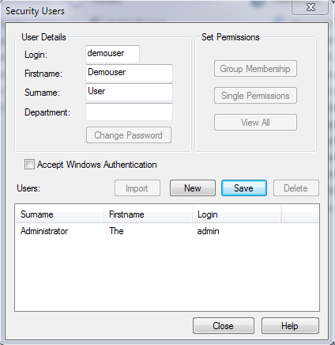
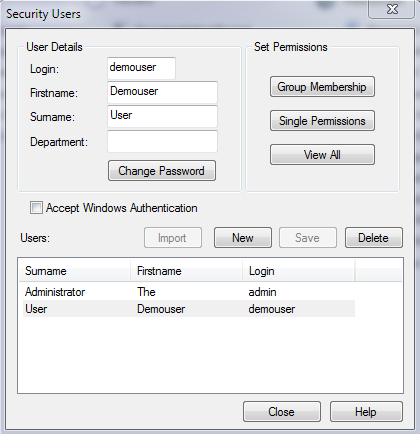
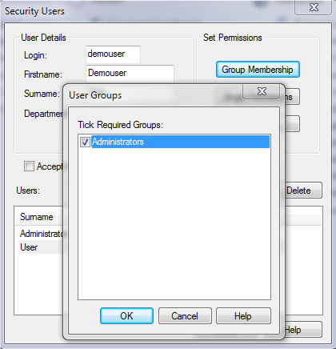
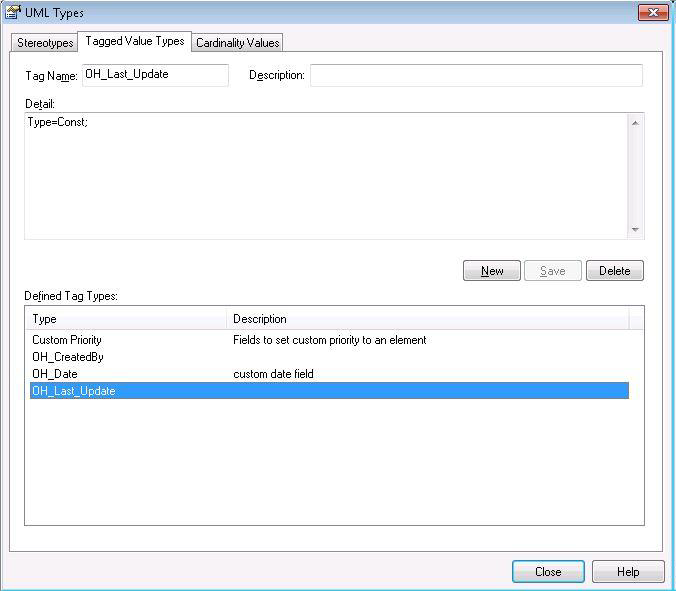
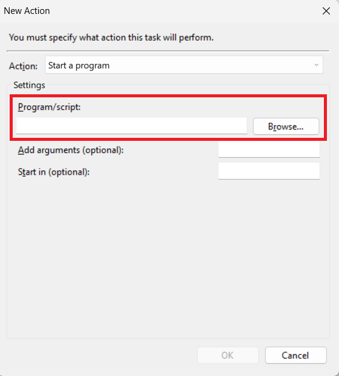
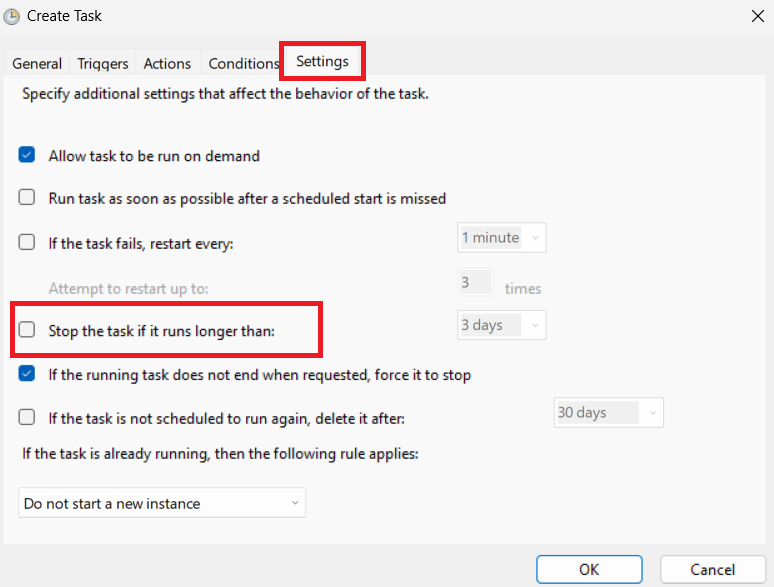

# Prerequisites

## User Privileges

- Create one administrator user of Enterprise Architect System , dedicated to {{ spaceName }}, only if the projects which will be used for synchronization have enabled security settings in Enterprise Architect System. This dedicated user should not do any operations from the system’s user interface.
- User should have access to all the projects that need to be synchronized.  
> **Note**: The Enterprise Architect app must **NOT** be configured to 'Run this program as an Administrator'. If the user is facing the error, 'Retrieving the COM class factory for component with CLSID {xxxxxxxx-xxxx-xxxx-xxxx-xxxxxxxxxxxx} failed due to the following error: 800702e4. The requested operation requires elevation.', then check if Enterprise Architect is configured to run as administrator. Uncheck this option if selected in the Compatibility tab in its Properties.  

## Proxy Service Prerequisites

- Operating System (Tested On) : Windows 7, Windows Server 2008, Windows Server 2012, Windows Server 2016, Windows Server 2019, Windows 10,  Windows 11
- OpsHubEAWindowsService must be installed on the same machine where Enterprise Architect application has been installed and should have .NET framework 4.7.2 or higher version installed on it.
- It is recommended to install OpsHubEAWindowsService on a machine having quad-core processor, 4GB RAM (minimum) and 4GB disk space (minimum).
- OpsHubEAWindowsService is configurable for Enterprise Architect installed on Windows 64-bit Operating System.
> **Note**: This prerequisite is compulsory regardless of the version of Enterprise Architect that the user is trying to integrate.  
Client Profile versions of .NET framework are not supported. It is recommended that the user installs the full version of the .NET framework.

## Setting up OpsHubEAWindowsService

- Check the availability of port 9393 as OpsHubEAWindowsService will be using port 9393 by default. Refer to [How to Change the Port of OpsHubEAWindowsService](#how-to-change-the-port-of-opshubeawindowsservice) section to change the default port of the OpsHubEAWindowsService.
- Locate the path `<{{ spaceName }}_INSTALLATION_PATH>\Other_Resources\Resources`.
- Extract the OpsHubEAService.zip package.
- Open `EAService.exe.config` in text editor. Scroll to the end of the file for this line:  
  `<add key="ATTACHMENT_PATH" value="C:\EAAttachments"/>`
- Set the value to a folder location where the local system has **write** access. (This step can be skipped if the user's local system has adequate write permissions in the local drive C). Attachments synchronizing from/to Enterprise Architect need to be saved locally. This folder will be used for saving the attachments locally.
  - This configuration is required even when attachment's synchronization is disabled.
- Go to `<{{ spaceName }}_INSTALLATION_PATH>\OpsHubEAService` folder, and run `EAService.exe` in administrator mode to start OpsHubEAWindowsService.
- Test the web service by opening this URL in browser: `http://<hostname>:9393/EAService`.  
  E.g. `http://localhost:9393/EAService`
> **Note**: After system restarts, OpsHubEAWindowsService needs to be restarted. To configure the OpsHubEAWindowsService to auto-start at system startup, refer to [Auto start OpsHubEAWindowsService on system startup](#auto-start-opshubeawindowsservice-on-system-startup) section.  
> **Note**: It is recommended that OpsHubEAWindowsService be stopped by pressing the enter key and not directly using the close button to release EA connections made through {{ spaceName }}.

## Register OpsHub's Extension for EA

- By default in Enterprise Architect (EA), the modified time of an entity does not update when link changes (additions, updates, or removals) occurs. As a result, these changes are not synchronized to the target because no modifications are detected in the modified time in EA.
- To overcome this limitation of Enterprise Architect, we have developed one custom plugin named "OpsHubEAAddIn". So whenever there are changes to the links, this add-in ensures to update the modified time of an entity.

**How to register OpsHub's Extension**

1. Locate the path `<{{ spaceName }}_INSTALLATION_PATH>\Other_Resources\Resources` on the machine where {{ spaceName }} is installed.
2. Copy the `OpsHubEAAddIn.zip` package on the desired machine where EA Client is installed and this extension need to be configure.
3. Extract `OpsHubEAAddIn.zip` package in the specific location on the same machine where zip file was copied.
4. Open **Command Prompt as Administrator** and navigate to the extracted folder location of `OpsHubEAAddIn`.
5. Execute the `RegisterOpsHubEAAddIn.bat` here by entering its name.
6. After executing the `RegisterOpsHubEAAddIn.bat`, select the Enterprise Architect (EA) version.  
<p align="center">
  
</p>

To identify the EA version, go to **Start** → **Help** → **About EA** to know about the EA version.  
<p align="center">
  
</p>
<p align="center">
  
</p>


While executing if it's prompted with `Value exists, overwrite(Yes/No)?` Please type **Yes**.  
<p align="center">
  
</p>

After the bat file is executed, open or restart the Enterprise Architect (EA) and go to **Specialize** section and see the **Manage Addin**, You will find OpsHub's extension added in the Available Add-Ins list with status Enabled.  
- Note: Status will show activated only when project present in the Enterprise Architect (EA).  
 <p align="center">
  
</p>

**Limitation of OpsHub's Extension**

- This extension will not update the modified time if any link changes occur through the API. It only works for changes made through the UI.

## Custom Field Configuration

It is required to create following custom fields for {{ spaceName }} to track the integration status of each element of Enterprise Architect that will be synchronized.

| Field Name     | Type  |
|----------------|--------|
| OH_Last_Update | Const  |
| OH_CreatedBy   | Const  |

Learn in detail about [Custom Field Creation in Enterprise Architect](#custom-field-creation-in-enterprise-architect).

## Enterprise Architect Data Sources Configuration for Running on a DBMS

- If the user is using Enterprise Architect with a MySQL database, then ensure that the MySQL Data Source is configured in his/her Enterprise Architect instance according to the documented steps given in [Set up a MySQL ODBC Driver](https://www.sparxsystems.com/enterprise_architect_user_guide/15.2/model_repository/setupmysqlodbcdriver.html).
- If the user is using Enterprise Architect with a Microsoft SQL Server Database, then ensure that the MSSQL Server Data Source is configured in his/her Enterprise Architect instance according to the documented steps given in [Connect to a SQL Server Repository](https://www.sparxsystems.com/enterprise_architect_user_guide/15.2/model_repository/connecttosqlserver.html).

## Accessing Enterprise Architect through Windows Remote Desktop

- If the user has installed Enterprise Architect on a different machine that requires a Windows Remote Desktop connection to access, then Enterprise Architect instance will not be able to connect with {{ spaceName }} server when the Remote Desktop session expires. This occurs as disconnecting the Windows Remote Desktop connection will terminate the logged in user's session. Enterprise Architect requires an active logged on user.
- If the user has such a scenario, then it is strongly recommended that he/she uses an alternative software for Windows Remote Desktop to connect to the machine where Enterprise Architect is installed, and does not require Windows authentication to log in to a remote machine.

# System Configuration

Before continuing the integration, the user must first configure Enterprise Architect. Click  [System Configuration](../integrate/system-configuration.md) to learn the step-by-step process to configure a system. Refer to the screenshot given below:

<p align="center">
  
</p>

For the format and guidance related to filling Metadata details in JSON form, please refer to [Understanding Json Metadata Input](../integrate/system-configuration.md#understanding-json-metadata-input) section.

> **Note**: Steps for registering OpsHubEAWindowsService is given in the section [Register OpsHubEAWindowsService](#register-opshubeawindowsservice).</p>

> **Note**: If the Enterprise Architect instance is configured to run on a database, then the user would need to save his/her database connection as a <code>.eap</code> file shortcut. Refer to [Create Project Shortcut](https://sparxsystems.com/enterprise_architect_user_guide/15.2/model_repository/create_copy_or_shortcut.html) for further details. Ensure that the Data Source in Enterprise Architect is configured according to the steps mentioned in the section [Enterprise Architect Data Sources Configuration for running on a DBMS](#enterprise-architect-data-sources-configuration-for-running-on-a-dbms).</p>

## Supported File Types

{{ spaceName }} supports following repository types:

* File Based Repositories:
  * .eap
  * .eapx
  * .qea
  * .qeax
  * .eadb
* Microsoft SQL Server
* MySQL

> **Note**: The user can view [Supported DBMSs](https://sparxsystems.com/enterprise_architect_user_guide/15.2/model_domains/supported_databases.html) by Enterprise Architect to check whether the database is supported by Enterprise Architect or not.</p>

# Mapping Configuration

Map the fields between Enterprise Architect and the other system to be integrated to ensure that the data between both the systems synchronize correctly.  
Click [Mapping Configuration](../integrate/mapping-configuration.md) to learn the step-by-step process to configure mapping between the systems.

## Synchronizing Diagram Image to the target system as an inline image

When Enterprise Architect is a source system and the user wants to synchronize the Diagram entity, then the Diagram's visualization as seen in Enterprise Architect can be synchronized to the target system in a rich text field as an inline image.

* For this, the user needs to map the Diagram Image field to a target rich text field on the Mapping Configuration page while creating a mapping for Diagram.
* The Diagram Image field will be a read-only field. This field should be mapped to a rich text field in the target system. This field in the target system should not be used for any other purpose except to synchronize the Diagram Image from Enterprise Architect.
* The name of the diagram image will be the diagram's GUID as visible in Enterprise Architect and is of PNG type. For example, if the diagram's GUID is `{4F5CD0CE-DC33-4d04-8537-DC0B57C6CB4E}`, then the name of the inline image in the target system will be `4F5CD0CE-DC33-4d04-8537-DC0B57C6CB4E.png`.
* Whenever the diagram's visualization is updated in Enterprise Architect, then the latest visualization will be synchronized to the target system.

## Synchronizing Diagram Image to the target system as an attachment

* The user can synchronize the Diagram Image to the target system as an attachment. The user needs to follow these steps:
  * Map the Diagram Image field to any target field. This field should not be used anywhere else in the mapping.
  * Edit the Advanced XSLT for this field mapping. Remove existing XSLT and paste the following XSLT:

```xml
<OHAttachments>
    <xsl:for-each xmlns:xsl="http://www.w3.org/1999/XSL/Transform" select="SourceXML/updatedFields/Property/OHAttachments/OHAttachment">
        <xsl:element name="{concat('attachment_',position())}">
            <filename>
                <xsl:value-of select="fileName"/>
            </filename>
            <addedByUser>
                <xsl:value-of select="addedByUser"/>
            </addedByUser>
            <contentLength>
                <xsl:value-of select="contentLength"/>
            </contentLength>
            <contentType>
                <xsl:value-of select="contentType"/>
            </contentType>
            <contentBase64>
                <xsl:value-of select="contentBase64"/>
            </contentBase64>
            <attachmentURI>
                <xsl:value-of select="attachmentURI"/>
            </attachmentURI>
            <updateTimeStamp>
                <xsl:value-of select="updateTimeStamp"/>
            </updateTimeStamp>
            <label>
                <xsl:value-of select="label"/>
            </label>
            <fileComment>
                <xsl:value-of select="fileComment"/>
            </fileComment>
            <attachmentReferenceType>
                <xsl:value-of select="'ENTITY_LEVEL'"/>
            </attachmentReferenceType>
            <uniqueCode>
                <xsl:value-of select="uniqueCode"/>
            </uniqueCode>
            <attachmentType>
                <xsl:variable name="xPathVariable" select="attachmentType"/>
                <xsl:value-of select="attachmentType"/>
            </attachmentType>
        </xsl:element>
    </xsl:for-each>
</OHAttachments>
```

- This XSLT will synchronize the Diagram Image as an attachment in the target system. If the user wants to revert the changes, then he/she can click on the _Restore Default_ button in the Advanced XSLT dialog box. This will synchronize the diagram image as an inline image.
- If the user wants to change the file name of the diagram image attachment in the target system, then the user can change the above given advanced XSLT by replacing the value of `<xsl:value-of select="fileName"/>` to `<xsl:value-of select="'<new_file_name.png>'"/>` in the `<fileName>` tag.  
  For example: `<xsl:value-of select="'DiagramImage.png'"/>` and ensure that the file name has the extension as `.png`.

## Synchronizing Operation and Attribute as entity to the target system

- When Enterprise Architect is a source system, user can synchronize 'Operation' and 'Attribute' features of Element as separate entities to the target system.
- For synchronizing entity types Operation and Attribute, the user needs to map the 'Operation'/'Attribute' entity of Enterprise Architect to any entity type in the target system.
- Please refer [Known Behavior](#known-behavior) section for more details on behavior of 'Operation' and 'Attribute' entities.
- Please refer [Known Limitations](#known-limitations) section for details on limitations of 'Operation' and 'Attribute' entities.

## Mapping Stereotypes

- The stereotypes present in the `t_stereotypes` table (to find list, query in SQL editor) in Enterprise Architect will be listed in the list of stereotype values. If the user wants to set the value of stereotype other than listed, it can be done from _Advanced Mapping Configuration_.
- For synchronizing stereotype values not present in list of 'Stereotype' field values, provide the value of required stereotype in _Advanced Mapping Configuration_.
  - For example, in Enterprise Architect `block` type of stereotype can be assigned to an element, but in {{ spaceName }}, this is not getting loaded in the list of values for 'Stereotype' field. So, if user wants to set the value of stereotype as `block`, its value should be provided as `block` from _Advanced Mapping Configuration_.
- The fully qualified stereotype value must be used in the _Advanced Mapping_ of the stereotype field for synchronizing stereotype values along with profile details.
  - For example, if the user wants to set profile `MARTE` for stereotype `allocated`, then `MARTE::allocated` value needs to be set for stereotype in the _Advanced Mapping_.
- It is recommended to analyze the EA's XML model before the sync of the profile of the stereotype field, as specific fully qualified stereotype values do not contain profile details. So, the EA XML model needs to be updated to sync with profile details.
  - For more details, refer to [How to update EA's XML Model to sync stereotype with profile in {{ spaceName }}](#how-to-update-eas-xml-model-to-sync-stereotype-with-profile-in-sitename) section.
- Alternatively, to map MDG elements, user has to select base entity type while configuring mapping and integration.
  - **Reason**: MDG elements are not visible directly in the entity type list.
- Stereotype field for any MDG element represents the _"Apply To"_ column which is the base element type. This element type can be mapped for fetching those MDG entities.

<p align="center">
  
</p>

For example:  
The base element type name of `Block` type is `Class`. If we create configuration in OIM using Element-Class as entity type, we should be able to synchronize Blocks.

## Mapping Different Link Types

- Enterprise Architect provides different possible directions for same link types. The different directions available for `Dependency` link type in Enterprise Architect are:
  - Unspecified
  - Bi-Directional
  - Source → Destination
  - Destination → Source

<p align="center">
  
</p>

- For configuring links on the basis of directions, corresponding link types should be mapped.  
  For example, for basic link type `Dependency` the other four link types available in {{ spaceName }} are:
  - Dependency__Bi-Directional
  - Dependency__Unspecified
  - Dependency__From  
    _Map this link type for synchronizing the dependency of current entity to the linked entity._
  - Dependency__To  
    _Map this link type for synchronizing the dependency of linked entity to the current entity._

- **Examples of link configuration for Enterprise Architect as source and target:**

  - **Source**:  
    Suppose two `Requirement` elements are created in Enterprise Architect: E1 and E2.  
    There is a dependency link from E1 to E2, the source entity is E1, target entity is E2 and the direction of link is from _Source → Destination_.  
    Now this link needs to be synchronized in the target system with `Parent` link, where E2 will be the parent of E1.  
    To achieve this, `Dependency__From` link type should be mapped with `Parent` link.

  - **Target**:  
    Suppose two entities e1 and e2 are created in the source system. Entity e1 is the parent of entity e2.  
    So corresponding to this, e2 should be dependent on entity e1 in Enterprise Architect.  
    To achieve this, `Parent` link type of source system can be mapped with `Dependency__From` link type of Enterprise Architect.  
    The other way is to map the `Child` link type of source system with `Dependency__To` link type of Enterprise Architect.

- **Limitations**
  - For the link types: `Aggregation` and `Nesting`, only `Destination → Source` direction is supported.  
    Due to Enterprise Architect API limitation, `Bi-Directional` and `Unspecified` directions will not be listed in the link types.

## Link Configuration in Operation and Attributes

- The link type supported for `Operation` and `Attribute` entities is: `Parent`
- The `Operation` and `Attribute` entities can be linked to other `Element` entity using `Parent` Link.

## Link Configuration for Package

- The link types supported for `Package` entity are: `Parent` and `Child`
  - The `Element` and `Diagram` entities can be linked to `Package` entity using `Parent` Link.
  - Similarly, the `Package` entity can be linked to `Element` and `Diagram` using the `Child` Link.
  - The `Package` entity can be linked to other `Package` entities using `Parent` or `Child` Link.

## Synchronizing Properties of Stereotypes

* Some of the stereotypes can have properties associated with them. For example, stereotype "allocated" of profile "SysML 1.1" have properties "allocatedFrom" and "allocatedTo".   

*To map the properties of stereotypes you need to do the following:  
1. [[Mapping_Configuration#View.2FEdit_XSLT_Configurations_options |Edit mapping XSLT]] to map the required property. The property must be added under XSLT of any custom property.  
2. Select "Sync" option under [Behavior for Absent Fields](../integrate/integration-configuration.md#behavior-for-absent-fields) in the integration settings.  

When Enterprise Architect is the source system and the property to be synchronized from source is "allocatedFrom", the XSLT will be:

```xml
<{fieldname of target}>
  <xsl:value-of select="SourceXML/updatedFields/Property/allocatedFrom-space--open-parenthesis-Tagged-space-Value-close-parenthesis-"/>
</{fieldname of target}>
```

When Enterprise Architect is the target system and the property to be synchronized in target is "allocatedFrom", the XSLT will be:
```xml
<allocatedFrom (Tagged Value)>
  <xsl:value-of select="SourceXML/updatedFields/Property/{fieldname of source}"/>
</allocatedFrom (Tagged Value)>
```

<p align="center">
  
</p>

<p> For Enterprise Architect, there must be an update in the field other than properties of stereotypes to sync changes in these properties.</p>

Reason: The modified time of entity in Enterprise Architect does not change for these types of properties.

## Synchronizing Extra Properties of Links

* Here is the advanced mapping configuration for entity reference mapping to synchronize the link's additional properties for the element entity:

```xml
<xsl:for-each select="additionalArtifactsDetails">
    <xsl:for-each select="*">
        <xsl:element name="{name(.)}">
            <xsl:value-of select="."/>
        </xsl:element>
    </xsl:for-each>
</xsl:for-each>
```

* For example, we need to assign the target link Aggregation field value:

```xml
<xsl:element name="Link Target Aggregation">
    <xsl:value-of select="0"/>
</xsl:element>
```

# Integration Configuration

Set a time to synchronize data between Enterprise Architect and the other system to be integrated. Also, define parameters and conditions, if any, for integration.  
Click [Integration Configuration](../integrate/integration-configuration.md) to learn the step-by-step process to configure integration between two systems.

# Criteria Configuration

Criteria-based integration is supported for System Fields in Enterprise Architect. This feature is based on Enterprise Architect’s Filter feature.  
Provide queries in a format that is acceptable by Enterprise Architect.

* Criteria to get entities whose *Type* is *Requirement*.  
  **Example:** `Object_Type = 'Requirement'`

* Criteria to get entities whose *Status* is *Approved*.  
  **Example:** `Status = 'Approved'`

* In providing criteria for complexity of a field, give its internal value. Find its internal value from the table.  
  Below is a criterion to get **entities whose *Complexity* is *Medium*.**  
  **Example:** `Complexity = '2'`

* Criteria can also contain and/or operators. Given below are two examples:
  * To get entities whose **Complexity** is **Medium**, **AND** *Type* is **Requirement**  
    `Complexity = '2' and Object_Type = 'Requirement'`
  * To get entities whose **Type** is **Issue** **OR** **Entity**  
    `Object_Type = 'Issue' or Object_Type = 'Entity'`

<p> To configure criteria on fields other than those stated above, find the field name in t_object table of Enterprise Architect and create a query on it using above references.</p>

## Criteria Configuration for 'Operation' and 'Attribute'

* Criteria to get **Operation** entities whose *Name* is *Operation1*  
  `t_operation.Name = 'Operation1'`

* Criteria to get **Operation** entities that are *Static* and on *Position 2*  
  `t_operation.IsStatic = True AND t_operation.Pos = 2`

* Criteria to get **Operation** entities that are *Protected* or are *Leaf* operations  
  `t_operation.Scope = 'Protected' OR t_operation.IsLeaf=False`

* Criteria to get **Attribute** entities whose *Name* is *Attribute1* and is *Static*  
  `t_attribute.Name = 'Attribute1' AND t_attribute.IsStatic=True`

* Criteria to get **Attribute** entities that are of Type *char* or has *Default* value *Def_Val*  
  `t_operation.Type = 'char' OR t_operation.Default='Def_Val'`

> **Note**: To configure criteria on fields other than the one stated above, find the field name in <strong>t_operation</strong> or <strong>t_attribute</strong> table of Enterprise Architect as per requirement and create a query on it using above references.</p>

# Known Behavior

* Enterprise Architect's entities will be synchronized without history because of API unavailability.

* For Enterprise Architect configured on Version Control, integration first checks out the package, makes the changes, and then checks in the package. Consequently, the changes get saved in the repository.
  * In case integration fails before checking in the changes, then cleanup for the checkout as in such cases of failures is not supported.
  * For example, if integration fails after checkout and before check-in, integration will not be able to undo checkout for that package.
  * It will only be checked in when next event will come on that package. Until that time, if someone wants to checkout that package from the other machine, they will have to manually undo the earlier checkout from Enterprise Architect UI using the machine that has it currently checked out.
  * The checkout is based on the Windows users.

* In EA, for the Notes field, the Bold, Italics, Underline, Font color formatting is allowed. Hence, for EA as the target system, `{{ spaceName }}` will support the above type of the formatting only.
  * Any formatting which is not allowed from EA UI, the formatting will be discarded.

* For custom fields/tagged values of type **CheckList**, user can have a list of possible values.  
  It is recommended to maintain the order of those possible values list because the Enterprise Architect API has dependency on it. The values set for this field is based on their position of the possible value in the list of checklist values. Hence, if that is not maintained, then it may lead to incorrect data synchronization in target system.
  * For example, if the list of values is A,B,C. And in the CheckList custom field, the user has checked values A,C.
  * Now if the list of values is updated to A,B,Z,C, then the value for that field will treat A,Z as checked instead of A,C.
  * The update, in that case, should ideally be A,B,C,Z.

* Following types of custom fields are supported as text type: `AddinBroadcast`, `Custom`, `ImageRef`.

* When Enterprise Architect is the target system and Diagram entity is being synchronized, **Notes** field will be used to set few details that are required for `{{ spaceName }}`'s internal use.  
  In case that field is mapped in the field mapping, then this value is appended to the value that is available after synchronization.  
  As this field contains the value which is used for synchronization purpose, it is strongly recommended to **not touch/change** the content of this section of the Notes. Rest of the content can be modified as per the need.  
  Here is a sample of the value which will be appended:

```
$$OH_CreatedBy:IntegrationUser
$$OH_Last_Update:1=1609163655000.0_0_1.0
```

* Known Behavior for Operation:
  * **Parameters field synchronization:**
    * Parameters field can be synchronized from Enterprise Architect to the target system using *Advanced Mapping*.
    * Currently, list of Parameters are available with Parameter details: Name, Type, Direction and Notes. These details can be synchronized to target system in desired format using *Advanced Mapping*.

* **Package Path synchronization:**
  * In Enterprise Architect System, Package Path is not directly associated with entity type *Operation*/*Attribute*, but it is associated with the parent entity type *Element*.  
    So if link is configured, the *Package Path* of parent *Element* can be synchronized along with *Operation*/*Attribute* to the synchronized target entity using *Advanced Mapping*.

* *Operation* and *Attribute* will be synchronized without history from Enterprise Architect to the target system.  
  They will be synchronized with the entity state/details available at the time of synchronization.

* **Known Behavior for Package:**
  * Additional field update(s) will be required to synchronize attachments, links and alias field.
    * **Reason:** In EA, the Package entity's modified time is not changed by adding an attachment, link or updating the alias field.

* When Enterprise Architect is the target system, only the following formatting such as **Bold**, *Italics*, __Underline__, and Font color will be reflected in **Notes** field.
  * **Reason:** Enterprise Architect UI Limitations.


## Known Limitations

* For Enterprise Architect version 10 and version 11, a manual update is mandatory for the cloned entities to get synchronized from Enterprise Architect (as modified time does not get modified for cloned entities and remains same as that of source).
* Updates from Enterprise Architect is synchronized to the target only when the time of an entity is changed as displayed in the **'Modified'** property. In such case, the user would need to update some field which will cause the modified time of that entity to be updated. For instance, adding a link to an element or adding a tagged value to an element does not change its **'Modified'** property.
* For Enterprise Architect as the target system, if the attachment file name contains **Windows invalid file name characters** (&lt;, &gt;, :, ", /, \, |, ?, *), then the file will not be added in Enterprise Architect. Consequently, the user will encounter a Processing Failure. To avoid this Processing Failure, it is recommended to follow file naming conventions as mentioned in [Microsoft File Naming Conventions](https://docs.microsoft.com/en-us/windows/win32/fileio/naming-a-file#naming-conventions). Additionally, if the user still wants to synchronize attachments having Windows invalid file name characters, then the user needs to refer to [Synchronize attachments with file names having invalid Windows characters](../integrate/OH-EA-0002).
* For Enterprise Architect as the source system, only attachments of type **'Local File'** will be synchronized to the target system. Attachments of type **'Web Address'** are not supported and will not be synchronized to the target system.
* Fields added through any type of plugins or MDG technologies are not supported.
* Inline files synchronization is not supported as of now. This limitation will be removed in future releases.
* For custom fields, **Value** as well as **Tagged Value Notes** exist. For **Memo** type of fields, only their **Tagged Value Notes** will synchronize to the target system. For the rest of the field types, only their **Value** will synchronize to the target system.
* On updating fields associated with some stereotypes, the modified time is not changed for the entity. The user will need to update some other field to synchronize the update.
* Criteria configuration is not supported for end system storage.
* Some stereotypes such as those associated with MDG profiles will not come in stereotypes list.
* Synchronization of Requirements, Constraints and Scenarios (under the Responsibilities tab of the Properties option) is not supported because of the API unavailability.

<p align="center">
  
</p>

<p align="center">
  
</p>

* **Limitations for 'Operation' and 'Attribute' Entities**
  * Common Limitations:
    * Entity types Operation and Attribute are only supported when Enterprise Architect is source system.
    * Discussion/Comments are not supported due to API limitation
    * 'Specialize' options available for 'Operation' and 'Attribute' entities in Enterprise Architect system are not supported due to API limitation.
    * 'Collaborate' options: Chat, Journal, Review, Send Message, Monitor Discussion available for 'Operation' and 'Attribute' entities in Enterprise Architect system are not supported due to API limitation.
  * Limitations specific to Operation entity:
    * The following features available at location: Operation -> Properties -> Properties in Enterprise Architect system, are not supported:
      * Redefined Operation and Raised Exception
      * Pre-Condition and Post-Condition
      * Behavior

<p align="center">
  
</p>


  * Limitations specific to Attribute entity:
    * The following features available at location: Attribute -> Properties -> Properties in Enterprise Architect system, are not supported:
      * Redefined Property and Subsetted Property
      * Constraints

<p align="center">
  
</p>


* Limitations specific to Element entity:
  * Recovery Limitations:
    * For Enterprise Architect as the target system, if during the update operation, any failure occurs, then as a part of update recovery of {{ spaceName }}, the properties[system/custom] of Element entity might get overriden.
    * Reason: Enterprise Architect API limitation
  * Link extra property Limitation:
    * Currently, we support the following link extra properties: Alias, Stereotype, and Aggregation.
	
# Appendix

## Add User

1. Open Enterprise Architect.
2. Go to **File** menu, select **Open Project**.
3. Open the Project in which the new user is to be added.
4. After opening the project, enable Security for the project. To enable Security:
   1. Go to Project Menu → **Security** and select **Enable Security**.
   2. Enter the authorization key and click **OK**. Security will be enabled with default user: admin and password: password.
   3. Now go to Project menu → **Security** and select **Login as Another User**.
   4. Login with the credentials configured above.
5. Security Users dialogue box will appear. Fill in the details.



6. Click **Save**.
7. Select the new user and **change the password** for that user, if required. By default, it will be set empty.



8. The user’s group membership needs to be changed. Select the user, click **Group Membership**, and check **Administrators** checkbox.



9. Finally, click **Ok** and **Close**. New user with administrator rights is created.

---

## Custom Field Creation in Enterprise Architect

For creating a custom field in Enterprise Architect, follow the steps given below:

1. Go to Enterprise Architect system’s user interface, click **Settings** menu, and select **UML Types…**
2. In the dialog box that opens, select **Tagged Value Types** tab.
3. Provide the name of the field in the **Tag Name** field.
4. Provide the description of the field in the **Description** field.
5. In the blank text area in the **Detail** field, provide field specifications such as its type, values, default value, lower bound, upper bound, stereotypes, etc.
6. After providing all the inputs, click **Save** to create the new field.

In the image below, the inputs given will create a new field named “OH_Last_Update” of type “Const”.



---

## How to Change the Port of OpsHubEAWindowsService

1. Open Windows File Explorer and navigate to the service installation folder at `<{{ spaceName }}_INSTALLATION_PATH>\Other_Resources\Resources\OpsHubEAService>`.
2. Open the file named **EAService.exe.config** in any text editor.
3. Search `<baseAddresses>` tag in the file. In the `<add>` tag under the `<baseAddresses>` tag, change the value of the attribute **baseAddress** which will be in the form of a URL. The default port of the URL will be 9393. Change it with the port on which the user wants to deploy the service. Save the changes.


---

## How to update EA's XML Model to sync stereotype with the profile in {{ spaceName }}

- Open XML model in editor.
- Navigate to the **Documentation** node of UMLProfile and verify that the profile contains **name** and **alias**. If it doesn't contain any value for name and alias, then mention values for them.

> Refer to the given example for more understanding:
```xml
<UMLProfile profiletype="uml2">
  <Documentation id="22612312-9" name="OneMTSConstraintProfile" version="1.0" alias="CustomMts" notes="OneMTSConstraintProfile"/>
  ...
</UMLProfile>
```

- Open EA, Import MDG Technologies.
- Create an element and validate that stereotype with a fully qualified name is getting assigned.

---

## Auto start OpsHubEAWindowsService on system startup

> **Note**: To auto-start OpsHubEAWindowsService from task scheduler requires a user session. To create a user session on system startup, refer to [Configure auto Logon for OpsHubEAWindowsService](#configure-auto-logon-for-opshubeawindowsservice) section.

- To auto start OpsHubEAWindowsService on system startup, create a task in task scheduler.
- Press `Windows + R` to open the Run Dialog.
- Type `taskschd.msc` and click on OK. The task scheduler will open.
- In the Task Scheduler application, navigate to Action and click on Create Task.
- In the General tab, specify the name of the task and enable the checkboxes:
  - "Run only when user is logged on"
  - "Run with highest privileges"


- In the Triggers tab, click New to create a new trigger. In the new trigger window, select "At startup" from the "Begin the task" drop-down option.
- In the advance settings of the new trigger, enable "Delay task for" checkbox and specify "3 minutes" in the textbox. Click OK to save the trigger.

> **Note**: A delay is necessary because auto logon takes some time to create a user session. Without the user session, OpsHubEAWindowsService cannot run.


- In the Actions tab, click New and provide the full path of `OpsHubEAServiceStartup.bat`. This file is present in OpsHubEA Service folder. Click OK.



> **Note**: In the OpsHubEAServiceStartup.bat file, replace `<Path of OpsHubEAService folder>` with the full path where OpsHubEAService folder is extracted.

- In the Settings tab, disable the checkbox, "Stop the task if it runs longer than", as this will stop the OpsHubEAWindowsService if it runs longer than the specified duration.


- Save the task.

---

### Configure auto Logon for OpsHubEAWindowsService

> **Note**: The user provided for auto login should be an administrator user.

**Configure auto login using "netplwiz":**

1. Press `Windows + R` to open the Run Dialog.
2. Type `netplwiz` and click OK. The netplwiz window will open.
3. In the Users tab, uncheck the checkbox labeled, "User must enter a username and password to use this computer".
4. Click Apply. A pop-up window will appear asking for user credentials.
5. Provide administrator user credentials. Click OK and save the configuration.

**Configure auto login using "Registry Editor":**

1. Press `Windows + R` to open the Run Dialog.
2. Type `regedit` and click OK. The Registry Editor will open.
3. To enable auto login from registry editor, refer to [Microsoft Docs – Turn on automatic logon](https://learn.microsoft.com/en-us/troubleshoot/windows-server/user-profiles-and-logon/turn-on-automatic-logon).

> **Note**: It is recommended to use the first method (**netplwiz**) to configure auto login because the password for the administrator is stored in plain text in the registry, which can lead to security issues. Netplwiz stores the password in encrypted form.

