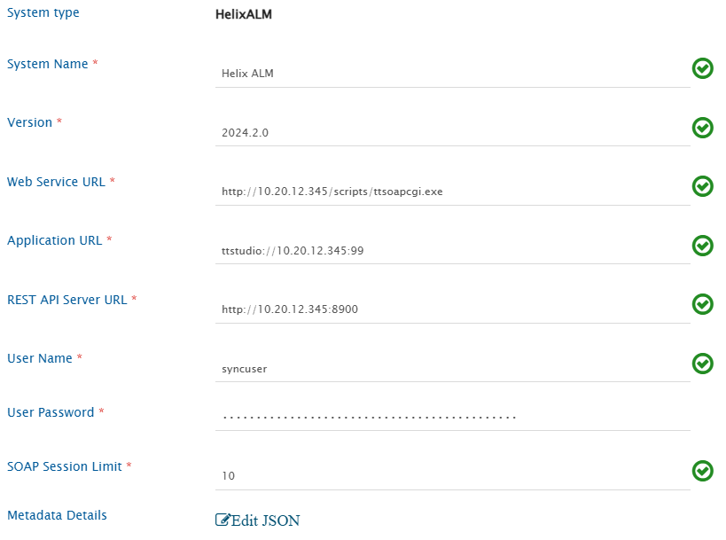
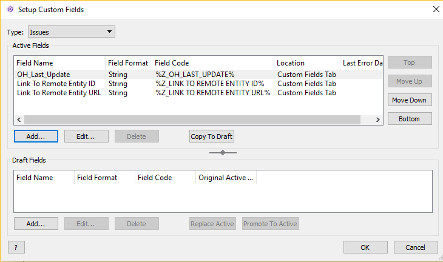
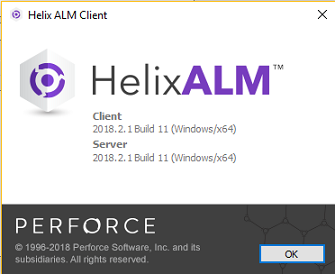

# Pre-requisites

## User privileges

* Create one user for Helix ALM System, dedicated to OpsHub Integration Manager. User should not be used to do any operations from system's user interface.  
* User should not be used to create or update any entities from Helix ALM user interface. For help on how to add user, please refer [[#add-user|Add User]] in appendix. For help on how to assign user to groups, please refer [[#giving-user-privileges|Assign User Privileges]] in the appendix.

## Custom field

One special field is required on the entity that is being synchronized to Helix ALM. This must be set up so that the integration status of each item can be tracked:

| **Property Name** | **Type** | **Size** |
|-------------------|----------|----------|
| OH_Last_Update    | String   | 255      |

For more details on adding custom fields, refer [[#custom-fields|Custom fields]] in appendix section.

## Other prerequisites

* Helix ALM SOAP CGI and Helix ALM REST API Server must be installed to communicate with Helix ALM Server. Refer to [Installing Helix ALM SOAP CGI](https://help.perforce.com/helix-alm/helixalm/current/sdk/Content/SDK/GettingStarted.htm) and [Installing Helix ALM Rest API Server](https://help.perforce.com/helix-alm/helixalm/current/restapi/Content/RESTAPI/InstallingAPI.htm) for more details.

# System Configuration

Before you continue to the integration, you must first configure Helix ALM. Click [System Configuration](../integrate/system-configuration.md) to learn the step-by-step process to configure a system.  
Refer the screenshot given below for reference.



<span style="color:blue">**Helix ALM system form details**</span><br>

| **Field Name**          | **When field is visible on the System form** | **Description**                                                                                                                                                   |
|------------------------|---------------------------------------------|-----------------------------------------------------------------------------------------------------------------------------------------------------------------|
| **System Name**        | Always                                      | Set **System Name** to **Helix ALM** or any other name you want. This name will appear throughout the application  
Note: **System Name** should be unique |
| **Version**            | Always                                      | Provide the supported version of Helix ALM System.                                                                                                             |
| **Web Service URL**    | Always                                      | Provide the **Helix ALM Server** Web Service URL. This URL is used for connecting to Helix ALM SOAP API. Format for URL: http://<host name>:<port no>/scripts/ttsoapcgi.exe. |
| **Application URL**    | Always                                      | Provide the Application Web URL, this URL is being used in constructing link to remote entity, hence keep this as per the Helix ALM client. e.g. ttstudio://<host>:<port> |
| **REST API Server URL**| Always                                      | Provide the **Helix ALM REST API Server** URL. This URL is used to connect to Helix ALM REST API Server.                                                         |
| **User Name**          | Always                                      | Provide username that will be used for synchronization.                                                                                                        |
| **User Password**      | Always                                      | Provide the user password.                                                                                                                                      |
| **SOAP Session Limit** | Always                                      | Provide the number of concurrent logins possible for the Helix ALM Server through the SOAP API. Refer to [Find SOAP Session Limit](#find-soap-session-limit) for more details. |
| **Metadata Details**   | Always                                      | Provide the details regarding system/custom fields of the Workflow events. Refer to [Understanding JSON Input](#understanding-json-input) for more information. |

If the system is deployed on HTTPS and a self-signed certificate is used, you will have to import the SSL Certificate to be able to access the system from OpsHub Integration Manager. Click [Import SSL Certificate](../getting-started/ssl-certificate-configuration.md) to learn how to import SSL certificate.  
For checking the version of your Helix ALM instance, refer [[#find-version|Find Version]] in appendix.

## Understanding JSON Input

* If the user wants to read some fields that are not available by default, then the user can provide those fields information in the form of JSON.  
* Refer the following example:

```json
{
    "entities": [
        {
            "displayName": "Issue",
            "internalName": "Issue",
            "fields": {
                "custom": [],
                "system": [
                    {
                        "displayName": "Is Marked As Suspect",
                        "internalName": "Is Marked As Suspect",
                        "dataType": "boolean",
                        "readOnly": true,
                        "historyEnabled": false
                    }
                ]
            }
        }
    ],
    "projects": []
}
```

* Refer to [Understanding Json Metadata Input](../integrate/system-configuration.md#understanding-json-metadata-input) section for more details on the JSON input.

* When Helix ALM is the target system and **Resulting State** field needs to be synchronized, JSON input must be provided.  
* For each entity, the system/custom fields information of Workflow events must be provided in the JSON input.  
* For each field (except OH_State_Event), the **outputType** of the field must be provided in the **systemSpecific** input.  
  * Refer the following table for the **outputType** of different field types.

| **Field Type**               | **Output Type**     |
|-----------------------------|---------------------|
| Check Box                   | boolean             |
| Date                        | date                |
| Date (Including time)       | dateTime            |
| Decimal                     | decimal             |
| Dropdown                   | menuItem            |
| Dropdown (Multiple values)  | menuItemArray       |
| Hyperlink                  | string              |
| Integer                    | integer             |
| Multi-line text            | formattedString     |
| String                     | string              |
| Users Dropdown             | user                |
| Users Dropdown (Multiple values) | userArray      |

* Following fields are mandatory in the JSON input for **Resulting State** field synchronization:  
  1. **Resulting State**  
     * It should be a lookup type of system field.  
     * The **lookupValues** should be such that both the key and value are the name of the resulting states.  
  2. **OH_State_Event**  
     * It should be a lookup type of custom field.  
     * It should be a read-only field.  
     * The **lookupValues** should be such that the key is the name of the state and value is the name of the event.

* Refer the following example of JSON input for the **Issue** entity:

```json
{
    "entities": [
        {
            "displayName": "Issue",
            "internalName": "Issue",
            
            "fields": {
                "custom": [
                    {
                        "displayName": "Resolution",
                        "internalName": "Resolution",
                        "dataType": "lookup",
                        "mandatory": false,
                        "historyEnabled": false,
                        "lookUpValues": {
                            "Clarification": "Clarification",
                            "Code Change": "Code Change",
                            "Documentation Change": "Documentation Change",
                            "Not a Bug": "Not a Bug",
                            "Not Our Bug": "Not Our Bug"
                        },
                        "systemSpecific": {
                            "outputType": "menuItem"
                        }
                    },
                    {
                        "displayName": "OH_State_Event",
                        "internalName": "OH_State_Event",
                        "dataType": "lookup",
                        "readOnly": true,
                        "mandatory": false,
                        "historyEnabled": false,
                        "lookUpValues": {
                            "Closed": "Force Close",
                            "Closed (Fixed)": "Fix",
                            "Closed (Verified)": "Verify",
                            "Fixed": "Fix",
                            "Open (Re-Opened)": "Re-Open",
                            "Open (Verify Failed)": "Verify"
                        }
                    }
                ],
                "system": [
                    {
                        "displayName": "Resulting State",
                        "internalName": "Resulting State",
                        "dataType": "lookup",
                        "mandatory": false,
                        "historyEnabled": false,
                        "lookUpValues": {
                            "Closed": "Closed",
                            "Closed (Fixed)": "Closed (Fixed)",
                            "Closed (Verified)": "Closed (Verified)",
                            "Fixed": "Fixed",
                            "Open": "Open",
                            "Open (Re-Opened)": "Open (Re-Opened)",
                            "Open (Verify Failed)": "Open (Verify Failed)"
                        },
                        "systemSpecific": {
                            "outputType": "menuItem"
                        }
                    },
                    {
                        "displayName": "Notes",
                        "internalName": "Notes",
                        "dataType": "text",
                        "mandatory": false,
                        "historyEnabled": false,
                        "systemSpecific": {
                            "outputType": "string"
                        }
                    }
                ]
            }
        }
    ],
    "projects": []
}
```

* Refer to [Workflow Transition Configuration](#workflow-transition-configuration) section for details on configuring different transitions for the Resulting State field.

# Mapping Configuration

Map the fields between Helix ALM and the other system to be integrated to ensure that the data between both the systems synchronizes correctly. Click [[mapping-configuration]] to learn the step-by-step process to configure mapping between the systems.  
Click [Mapping Checkpoints](#mapping-checkpoints) to learn about mapping checkpoints for Helix ALM as a target system. 

## Get Requirement Document Id's for Requirement

* In Helix ALM, a single Requirement can be added to multiple Requirement Documents.  
  * To fetch the record id's of all such Requirement Documents, the [[advance-mapping-utility#get-field-value-of-entity|Get field Value of Entity]] utility can be used. In this utility method, the **Related Requirement Documents** will be used as field name.  
  * This utility will return all the Requirement Documents record id's separated by a comma.  
    * For example, if a Requirement is added to multiple Requirement Documents having record id's 1, 2, and 3, the utility will return "1,2,3".  
  * Given below is a sample advance XSL for getting the Requirement Documents record id's:

```xml
<xsl:variable name="projectKey" select="SourceXML/opshubProjectKey"/>
<xsl:variable name="entityId" select="SourceXML/opshubEntityId"/>
<xsl:value-of select="utils:getEntityFieldValue($workflowId,$sourceSystemId,$projectKey,$entityId,'Related Requirement Documents')"/>
```

Set a time to synchronize data between Helix ALM and the other system to be integrated. Also, define parameters and conditions, if any, for integration.<br>

Click [Integration Configuration](integration-configuration.md) to learn the step-by-step process to configure integration between two systems.

## Criteria Configuration

If you want to specify conditions for synchronizing an entity between Helix ALM and the other system to be integrated, use the Criteria Configuration feature. Go to the Criteria Configuration section on the [Integration Configuration](integration-configuration.md#criteria-configuration) page for details.

To configure criteria in Helix ALM, integration needs to be created with Helix ALM as the source system.

Refer to the following table for some sample criteria queries:

| **Field Type**         | **Criteria Description**                                           | **Criteria snippet**                       |
|------------------------|--------------------------------------------------------------------|--------------------------------------------|
| **Lookup**             | Synchronize all entities having a certain value in Lookup          | 'Priority' = 'High'                         |
| **Date**               | Synchronize all entities created after a certain date              | 'Date Created' >= '2025-01-01'             |
| **Text**               | Synchronize all entities containing 'UI' in Summary field          | Summary CONTAINS 'UI'                      |
| **User**               | Synchronize all entities created by the 'SupportUser'. Use '<First Name> <Middle Initials> <Last Name>' format. | 'Created By' = 'OpsHub Support User' |
| **Lookup** or **Text** | Synchronize all entities with Priority = 'High' and 'UI' in Summary | 'Priority' = 'High' and 'Summary' CONTAINS 'UI' |

Refer to [Helix REST API Documentation](https://help.perforce.com/helix-alm/helixalm/current/restapi/Content/RESTAPI/LimitingItemsReturned.htm) to check different criteria queries available.

## Known Behavior

- If Helix ALM is the target system:
  - Inline image synchronization is not supported.  
    **Reason:** Helix ALM API limitation.
- Speed of synchronization will be affected in the **following scenarios:**
  - The integration user is associated with a named license.
  - The integration user is associated with a floating license, but the number of projects configured for integration exceeds the **SOAP Session Limit** provided in the system configuration form.  
    **Reason for above-mentioned scenarios:** To execute a SOAP API, {{SITENAME}} needs to first log into the project. Every login consumes a license. If more projects are configured, login and logout operations will be performed repeatedly, causing slowness in synchronization.

### Attachment Synchronization

For Helix ALM Issue entity, there can be multiple reports available [under Detail tab] and each of this report can have multiple attachments.

- While synchronizing attachments from Helix ALM, all the attachments from all these reports will be synchronized to the target system.
- While synchronizing attachments to Helix ALM, all the attachments added in to other end system will be synchronized to the 1st report.

The examples given below will help you understand the attachment synchronization behavior with bidirectional synchronization.

Let's assume that we have a bidirectional integration configured between Helix ALM 'Issue' and VersionOne 'Defect' with attachment synchronization enabled in mapping configuration.

- If Issue 1 has 2 reports and each of them has 1 attachment [let's assume : R1 is attachment for Report 1 and R2 is attachment for Report2], in VersionOne Defect, 2 attachments [R1,R2] will be visible
- Now if we add 1 attachment [V1] to VersionOne Defect, the attachment will be synchronized to the 1st Report (so Report 1 will have 2 attachments [R1,V1] and Report 2 will have 1 attachment [R2])  
  Report 2 attachments will be untouched and won't be added back to Report 1.
- If we edit the attachment R1 in VersionOne Defect, the attachment will get deleted and, instead, add an attachment R1 on the 1st report.  
  But if we edit the attachment R2 in VersionOne, it will be added to Report 1 and the attachment for Report 2 will be as it is (This is because of a known limitation)

### Relationship Synchronization

Given below are the expected behaviors while writing links to Helix ALM:

- Links created by {{SITENAME}} will have only two entities participating in it. Suppose three issues "issue1", "issue2", and "issue3" are linked by "Related Items" in some source system. These links will be synced to Helix ALM as two different links for all of them. So, for the above case, it will be three different links "issue1" related to "issue2", "issue2" related to "issue3" and "issue3" related to "issue1".
- Link won't be added if link type "Require Comment" is enabled for link type. 

Following are expected behaviors while reading links from Helix ALM:

- If there are two links having same parent and same set of children, {{SITENAME}} will consider only one link.
- If there are more than 2 items participating in any link, it will be split in more than one link.

Suppose Requirement "req1" is related to 2 test cases "test1" and "test2" through "Requirement Tested By" type of link (it is one link with single parent and two children). In this case, two links will be synced by {{SITENAME}}, one with each child "test1" and "test2". 

## Workflow Transition Configuration

- When Helix ALM is the target system and user wants to synchronize **Resulting State** field, the Workflow Transition must be configured to transition from one state to another.
- In Helix ALM, each Workflow event can have multiple fields. Some can be mandatory also.
- To synchronize such fields, the user needs to provide them as dependent fields in the Workflow Transition XML.
- Refer to the following sample Workflow Transition XML for the **Resulting State** field:

```xml
<FieldTransitions>
  <FieldTransition>
    <transitionName>transitionName 1</transitionName>
    <fromField>Resulting State</fromField>
    <toField>Resulting State</toField>
    <sourceValue/>
    <targetValue>Open</targetValue>
    <defaultTransition>true</defaultTransition>
  </FieldTransition>
  <FieldTransition>
    <transitionName>transitionName 2</transitionName>
    <fromField>Resulting State</fromField>
    <toField>Resulting State</toField>
    <sourceValue>Open</sourceValue>
    <targetValue>Fixed</targetValue>
    <dependentFields>
      <dependentField>
        <fieldName>Resolution</fieldName>
        <defaultValue>Code Change</defaultValue>
      </dependentField>
      <dependentField>
        <fieldName>Notes</fieldName>
        <defaultValue>State changed from Open to Fixed</defaultValue>
      </dependentField>
    </dependentFields>
  </FieldTransition>
  <FieldTransition>
    <transitionName>transitionName 3</transitionName>
    <fromField>Resulting State</fromField>
    <toField>Resulting State</toField>
    <sourceValue>Open</sourceValue>
    <targetValue>Closed (Fixed)</targetValue>
    <dependentFields>
      <dependentField>
        <fieldName>Resolution</fieldName>
        <defaultValue>Documentation Change</defaultValue>
      </dependentField>
      <dependentField>
        <fieldName>Notes</fieldName>
        <defaultValue>State changed from Open to Closed (Fixed)</defaultValue>
      </dependentField>
    </dependentFields>
  </FieldTransition>
  <FieldTransition>
    <transitionName>transitionName 4</transitionName>
    <fromField>Resulting State</fromField>
    <toField>Resulting State</toField>
    <sourceValue>Open</sourceValue>
    <targetValue>Closed</targetValue>
    <dependentFields>
      <dependentField>
        <fieldName>Resolution</fieldName>
        <defaultValue>Clarification</defaultValue>
      </dependentField>
      <dependentField>
        <fieldName>Notes</fieldName>
        <defaultValue>State changed from Open to Closed</defaultValue>
      </dependentField>
    </dependentFields>
  </FieldTransition>
  <FieldTransition>
    <transitionName>transitionName 5</transitionName>
    <fromField>Resulting State</fromField>
    <toField>Resulting State</toField>
    <sourceValue>Fixed</sourceValue>
    <targetValue>Closed</targetValue>
    <dependentFields>
      <dependentField>
        <fieldName>Resolution</fieldName>
        <defaultValue>Not Our Bug</defaultValue>
      </dependentField>
      <dependentField>
        <fieldName>Notes</fieldName>
        <defaultValue>State changed from Fixed to Closed</defaultValue>
      </dependentField>
    </dependentFields>
  </FieldTransition>
</FieldTransitions>
```

### Administrative Configurations

Recommended link configurations in Helix ALM:

- Set "Limit number of items to": to 2, so that more than one entity is not participating in link.
- Keep "Require Comment" option disabled.
- Avoid circular linking of issue for parent/child type of links. It will create ambiguity in the target systems, as this feature is not supported in most of the other systems.
- Don't change the project name once integrations are configured.

## Known Limitations

- {{SITENAME}} does not support synchronization of **Test Config** field present under **Detail** tab in the **Issue** entity.
- Synchronization of only **Comment Workflow event** is supported.
- For Issue entity, the field label of all the Found By Records field should not be changed. It should be set to the default value.  
  Found By Record fields supported by {{SITENAME}} are Description, Steps to Reproduce, Other Hardware and Software, Version Found, Found By, Date Found, Reproduced.
  - If the label of the field is changed in the end system, the mapping needs to be updated in the {{SITENAME}}.
- If Requirement entity is configured for synchronization and Relationships synchronization is enabled:
  - There should not be a custom link type in Helix ALM having same name as either "Requirement Relationships(Parent)" or "Requirement Relationships(Child)".
- If Helix ALM is the source system:
  - For the Issue entity, there can be multiple reports available [under the Detail tab], and each of these reports can have multiple fields with multiple inline images.
    - All the fields of the first record only will be synchronized.
    - The inline image synchronization for all the fields of the first report is only supported.
- If Helix ALM is the target system:
  - Synchronization of "Requirement Relationships(Parent)" and "Requirement Relationships(Child)" links is not supported.
  - Synchronization of different fields of the first Found By Record of Issue entity is supported.

## Appendix

### Add User


For adding a new user, follow the steps given below:

- Log in to Helix ALM as a user with 'Administration' security group.
- Choose **Create > Users**. The **Add User** form will show.
- Enter the Username, First Name and Password.
- Select Security Groups **Administration**.
- Click the **Add** button.

### Giving User Privileges


For giving privileges, follow the steps given below:

- Log in to Helix ALM as a user with Administration security group.
- Choose **View > Security Groups**. The security groups listing will show.
- Select the appropriate **Security Group** from the list in which to add the user. And click **Edit**, this will display the **Edit Security Groups** screen.
- From the left panel, select **Users in Groups**.
- From the right panel in **Available Users** section, select the user(s) that needs to be added to the current security group. Click the **Add** button.
- Click the **OK** button.


### Custom fields

{{SITENAME}} requires a few special fields to be defined on the entity that is being synchronized. These must be set up so that the integration status of each item can be tracked.


* Log in to Helix ALM as a user with Administration security group.
* Choose **Tools** > **Administration** > **Custom Fields**. The **Setup Custom Fields** dialog box opens.
* Select the entity type in **Type** dropdown list (In this case, we will select **Issues**).
* Click the **Add button** link, and click the **Add Custom** field link on the presented page. The **Add Custom** field screen will display.



* Fill in the **Field** name, **Long label** and **Field** code.
* Select the appropriate **Field** type field the list. 
* Click the **OK** button.

### Find version

For getting Helix ALM version, follow the steps given below:



* Log in to the Helix ALM project using Helix ALM client.
* Go to **Help** menu and in that click **About Helix ALM Client** menu item. The Helix ALM Client, dialog will display.
* Given here is the version for the Helix ALM server.

### Find SOAP Session Limit

* Log in to License Server Admin Utility as a user with Administration security group.
* Click the **Licenses** button.
* For the active license:
  * if you have a X-user floating evaluation license, provide the **SOAP Session Limit** as X.
  * If you have a X-user named license, provide the **SOAP Session Limit** as 1.
