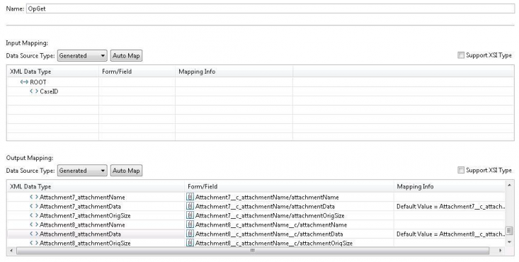
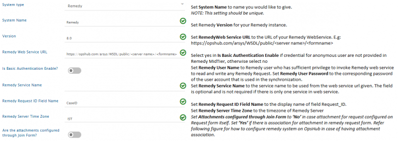
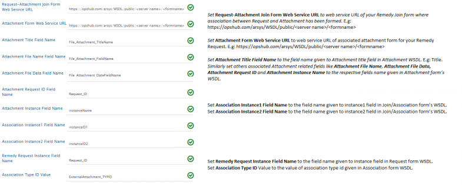
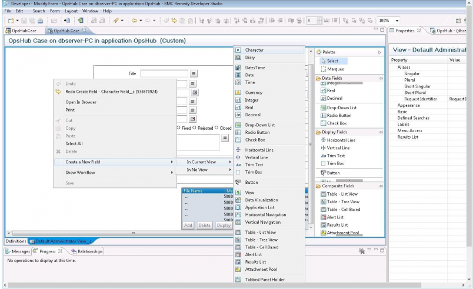
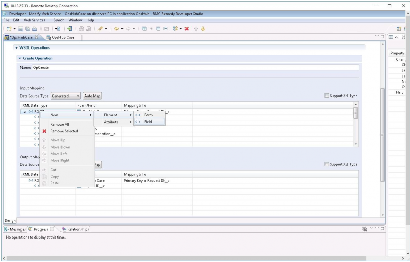
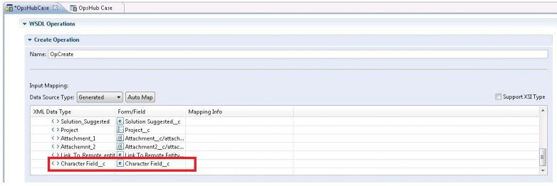

## Prerequisites

## User Privileges

No user is required for Remedy connector.

## Custom Field Configuration

The OpsHub Integration Manager requires one special field to be defined on the entity that is being synchronized. This must be set up so that it can track the integration status of each item:

| **Property Name**   | **Type** |
|---------------------|----------|
| OH_Last_Update      | Text     |

### Web Service Checks

* Create one new web service `OpGetListID` of type `OpGetList` with Qualification as input and the following fields in output:
  * Request_ID
  * Arrival_Time
  * Modified_Date/Modified_Time
* Operation name in web service should be `OpGet`, `OpGetListID`, `OpSet`, and `OpCreate`.
* `Arrival_Time/Create_Time` and `Modified_Time` should be mapped to the output result in `OpGet` and `OpGetListID` operation.
* `OpGetListID`'s output type should be unbounded.
* There should be no default qualification set for `OpGetListID`.

### Web Service Checks for Attachment Synchronization

If attachments in Remedy form are configured within the form, then make sure you have the right configuration in Remedy web-service for `OpGet` and `OpSet` operation.

Attachment name, data, and size field should be configured in the following format in `OpGet` and `OpSet` operation of Remedy:

* Attachment name field: `Attachment<Attachment_number>_attachmentName` with data type `String`.
* Attachment data field: `Attachment<Attachment_number>_attachmentData` with data type `base64binary`.
* Attachment size field: `Attachment<Attachment_number>_attachmentOrigSize` with data type `int`.
* For example:  
  `Attachment1_attachmentName`,  
  `Attachment1_attachmentData`,  
  `Attachment1_attachmentOrigSize`.

# System Configuration

Before you continue to the integration, you must first configure Remedy onto OpsHub Integration Manager.  
Click [System Configuration](../integrate/system-configuration.md) to learn the step-by-step process to configure a system.

Refer the screenshot given below for reference:

  

If the system is deployed on HTTPS and a self-signed certificate is used, then you will have to import the SSL Certificate to be able to access the system from OpsHub Integration Manager.  
Click [Import SSL Certificates](../getting-started/ssl-certificate-configuration.md) to learn how to import SSL certificate.

# Mapping Configuration

Map the fields between Remedy and the other system to be integrated to ensure that the data between both the systems synchronizes correctly.  
Click [Mapping Configuration](../integrate/mapping-configuration.md) to learn the step-by-step process to configure mapping between the systems.

# Integration Configuration

Set a time to synchronize data between Remedy and the other system to be integrated. Also, define parameters and conditions, if any, for integration.  
Click [Integration Configuration](../integrate/integration-configuration.md) to learn the step-by-step process to configure integration between two systems.

# Criteria Configuration

## Query

Remedy query can be formed using the name given to field at the time of creating it (e.g., Priority, Status, Create Time, Modified Time).  
The Query Format is: `'Field Name' [Supported Operator] value`  
Supported Operators: `>`, `<`, `=`, `!=`, `AND`, `OR`, `>=`, `<=`  
Value: If the field type is string, then the value should be enclosed in double quotes.

## Sample Query

Examples:  
`'Priority' = "Must"`  
`'Priority' = "Must" AND 'Status' = "New"`  
`'Create Time' > "12/12/2013"`

# Appendix

## Create Custom Field

To create a new custom field in Remedy, follow the steps given below:

* As shown in the image below, right click **Remedy** form to add a new field.

* Add mapping for that field in web-service's operations: `OpGet`, `OpSet`, `OpCreate`.

  

* Save web-service and the form.
* Restart the Remedy Tomcat Server.
