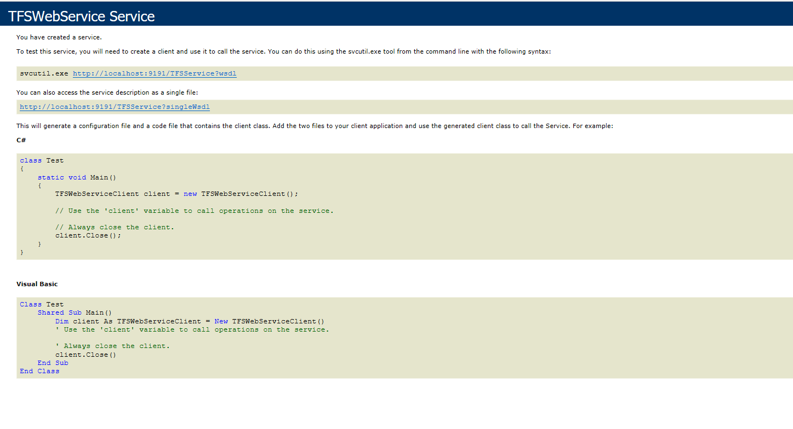

## Description

By default OpsHubTFSService is registered on port number `9090`. If `9090` port is used by any other application/process, then you can change the port number.

## Solution

To change default OpsHubTFSService port number you need to perform the following steps:

* Open file `<{{SITENAME}}_INSTALLATION_PATH>\Other_Resources\Resources\OpsHubTFSService\opshubtfsservice.exe.config`.
* Find the line `<add baseAddress="http://localhost:9090/TFSService"/>` and instead of `9090` change port number with which you are going to register.  
  e.g. If you want to register with `9191` then change the line as `<add baseAddress="http://localhost:9191/TFSService"/>`.
* If you have not registered the OpsHubTFSService then refer [this](register-opshubtfsservice.md) for registering OpsHubTFSService.  
  If you have already registered OpsHubTFSService then restart OpsHubTFSService service.

## Validate

After changing OpsHubTFSService port number, you can validate by opening this URL in browser:  
`http://<hostname>:<port>/TFSService`  

E.g. if you have used port number `9191` then use URL: `http://localhost:9191/TFSService`.  

If port number is changed successfully, the following output will be opened in browser after hitting the URL:  

