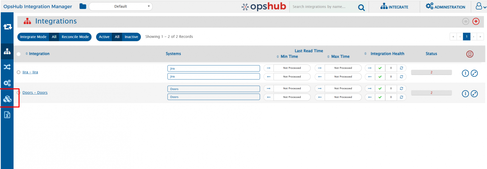
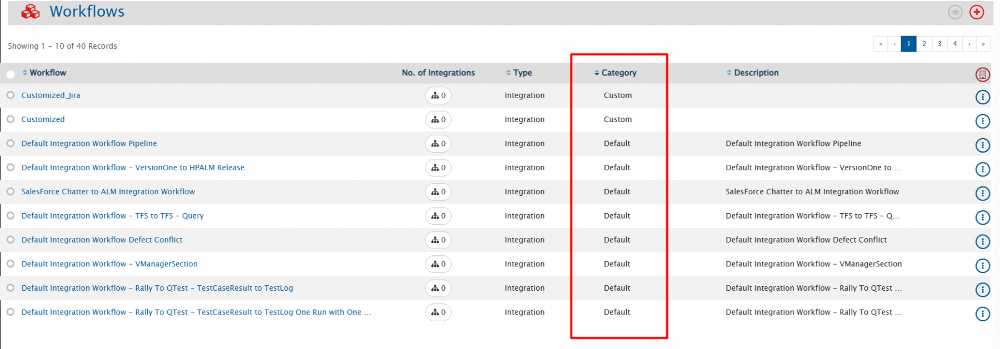
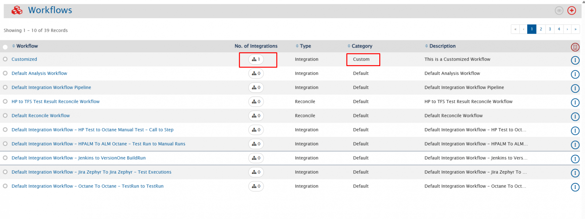
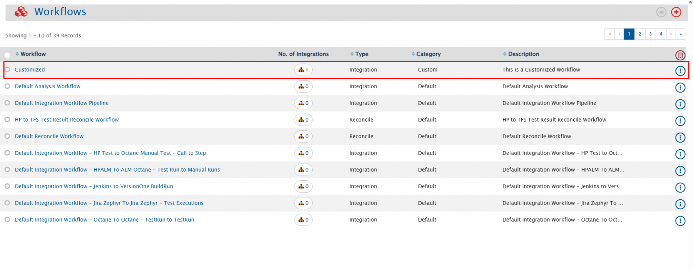

# Solution: Identifying Workflow Categories

In **OpsHub Integration Manager**, you can view workflow categories in the UI to easily identify default workflows from custom ones.

### Steps to View Workflow Categories

1. Navigate to the **View Integrations** page.

2. Click on the **Configure Workflow Screen** option from the left bar.

3. On the Workflow page, you can see a list of all workflows, along with associated integration details, workflow type, category, and description.  
Here, the **Category** column shows if a workflow is **Default** (pre-installed) or **Custom** (user-created). This allows you to quickly identify the category of each workflow.

4. To view the integrations associated with a particular workflow, refer to the **No. of Integrations** column. For **Customized Workflow**, click on the number under "No. of Integrations" to view the integrations linked to the customized workflow.

- This will show the integrations associated with **Customized Workflow**.

- Similarly, for **Default Workflow**, click on the number under "No. of Integrations" to view the integrations linked to the default workflow.

This streamlined process allows for easy identification and tracking of workflow categories and their associated integrations.
